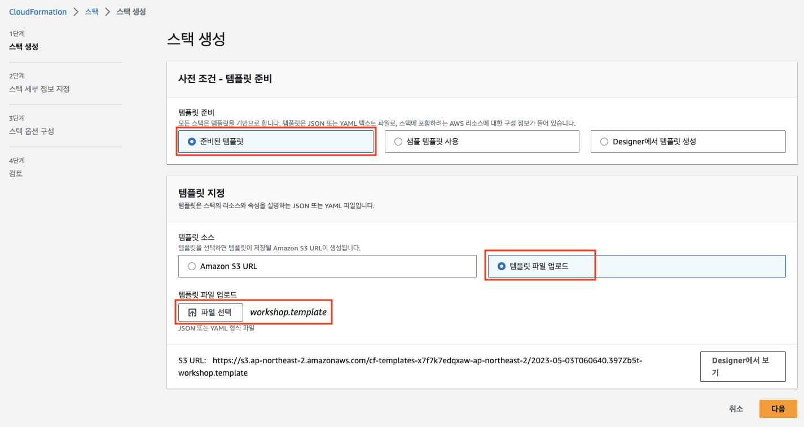
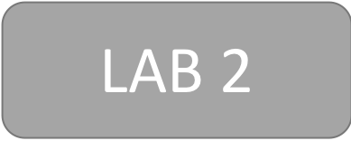

# <p align="center">AWS SaaS Factory Monolith to Serverless SaaS Workshop</p>

## Overview

단일 테넌트 모놀리식 아키텍처에서 멀티테넌트 모던 아키텍처로의 전환은 많은 조직에게 어려운 도전이 될 수 있습니다. 모놀리식 환경에서의 밀접한 결합과 종속성으로 인해 시스템을 마이크로서비스로 옮기기가 특히나 어렵습니다.

이러한 복잡성을 감안할 때 많은 조직에서는 "빅뱅" 으로 여러분의 시스템을 다시 만들기 보다는 점진적으로 현대적인 멀티테넌트 아키텍처로 변환되는 방식으로 마이그레이션을 시도할 것 입니다.
이러한 접근법은 점진적으로 기존 아키텍처를 새로운 아키텍처 모델로 이동 하는 중에 기존 고객들을 계속해서 지원 할 수 있는 방법을 찾고 있는 조직/비지니스에 적합할 것입니다.

이번 워크샵의 목표는 모놀리식에서 서버리스 SaaS 로 마이그레이션을 통해 마이그레이션 과정에서 발생하는 일반적인 문제들을 심층적으로 살펴보는데 있습니다.<br>
각 솔루션들은 그들만의 고유한 마이그레이션 도전 과제(문제)를 갖고 있을 겁니다. 하지만 실제로 동작하는 예제 애플리케이션을 통해 모놀리식 환경을 멀티테넌트 SaaS 모델로 이동하는 접근 방법을 구체화 하는데 도움이 되는 패턴들과 전략을 얻을 수 있는 것이 목적입니다.

이 워크샵에서는 실제로 동작하는 샘플 애플리케이션을 위해 전통적인 모놀리식 아키텍처로 시작할 것입니다.<br>
그런 다음 단일 테넌트 모놀리식 아키텍처의 요소를 최신 멀티테넌트 솔루션으로 점진적으로 마이그레이션할 것입니다. 여기에는 S3에서 호스팅되는 최신 웹 애플리케이션으로의 이동, API Gateway 도입, 애플리케이션 계층을 서버리스 마이크로서비스로 분해, 단일 데이터베이스에서 데이터 분리 후 이 데이터에 대한 관리를 대신하는 개별 마이크로서비스로 이동하는 작업이 포함됩니다. 또한 여러분들의 솔루션에 도입할 만한 멀티테넌트 모범 사례를 소개할 것 입니다.

## How do I start?
1. 우선 아래 URL에 있는 파일들을 자신의 로컬 컴퓨터로 다운로드 합니다. 이들 파일들은 Lab의 기본적인 구성을 배포하고 필요한 파일들을 자신의 S3로 복사하거나 정리하는데 사용됩니다 (Bootstrapping). 
   1. CopyS3Object.jar: https://github.com/shkim4u/aws-saas-factory-serverless-workshop/raw/main/resources/(my)-saas-workshop-bucket/ClearS3Bucket.jar
   2. ClearS3Bucket.jar: https://github.com/shkim4u/aws-saas-factory-serverless-workshop/raw/main/resources/(my)-saas-workshop-bucket/ClearS3Bucket.jar
   3. workshop.template: https://github.com/shkim4u/aws-saas-factory-serverless-workshop/raw/main/resources/(my)-saas-workshop-bucket/workshop.template
2. 자신의 AWS 계정 (이벤트 엔진)에서 적당한, 그렇지만 글로벌 전역적으로 유일한 이름을 가진 S3 버킷을 생성하고 여기에 위에서 다운로드 받은 파일을 업로드합니다. CloudFormation 템플릿인 workshop.template 파일은 굳이 업로드하지 않아도 되지만 CloudFormation을 생성하는 다른 방법을 제공하므로 함께 업로드하도록 하겠습니다.
   1. S3 버킷 이름 형식: ```<영문 이름>-saas-workshop-bucket```
      2. 예) ```sanghyoun-saas-workshop-bucket```
   3. S3 버킷 예제 화면
      4. 
3. 1에서 다운로드 받은 CloudFormation 템플릿인 workshop.template 파일을 사용하여 CloudFormation 스택을 배포합니다.
   1. CloudFormation 템플릿 지정
      
   2. 스택 이름 및 Bootstrap S3 버킷 이름 지정
      
   3. 다른 값들은 기본값을 받아들이고 다음 단계로 진행하여 스택을 생성합니다.
   4. 스택 생성 시간은 RDS 생성이 필요하여 다소 시간이 걸리며 대략 20 ~ 30분이 소요됩니다.

<br></br>
스택 리소스가 생성되는 동안 우리는 Lab을 살펴보도록 하겠습니다.

## Lab 1 – Deploying, Exploring, and Exercising the Single-Tenant Monolith

[](./lab1/README.md "Lab 1")
<br></br>

## Lab 2 – Onboarding, Identity, and a Modern Client

[](./lab2/README.md "Lab 2")
<br></br>

## Lab 3 – Carving Out Our First Multi-Tenant Serverless Microservice

[](./lab3/README.md "Lab 3")
<br></br>

## Lab 4 – Extracting the Remaining Service — Goodbye Monolith!

[](./lab4/README.md "Lab 4")

[Lab 1 시작하기](./lab1/README.md)

## License

This workshop is licensed under the MIT-0 License. See the LICENSE file.
