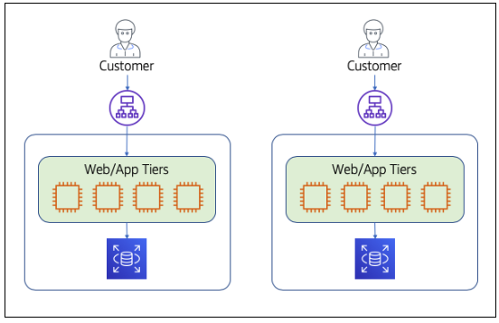
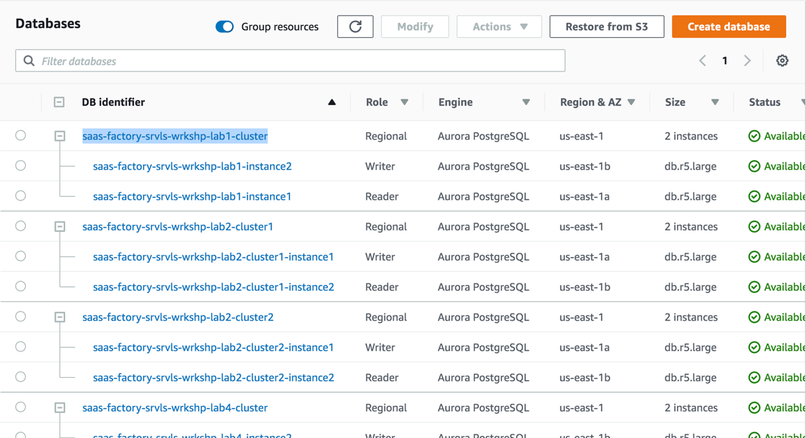

# Lab 1 – Deploying, Exploring, and Exercising the Single-Tenant Monolith

앞으로 진행할 멀티테넌트 SaaS로의 마이그레이션 과정은 미리 만들어 둔 기본적인 모노리식 애플리케이션과 함께 시작합니다. 우리는 이를 위해 다른 조직에서도 많이 사용하는 일반적인 Java 기반 기술 스택을 바탕으로 만들었습니다. 이 예제는 Java를 사용하지만 Java에만 가능한 스택이 아닙니다. 예를 들어 .NET 모놀리식 애플리케이션 역시 우리가 만든 것과 매우 유사한 형태가 될 수 있을 것입니다.

우리가 만든 모놀리식 아키텍처는 시스템의 웹 애플리케이션 계층이 로드 밸런싱되고 확장 가능한 인스턴스들로 호스팅되는 전통적인 EC2 모델을 기반으로 합니다. 이러한 웹 애플리케이션 계층은 코드 내에서 논리적으로 분리되어 있지만 하나의 모놀리식 단위로 배포됩니다. 따라서 웹 경험이나 비즈니스 로직을 변경하려면 하나의 모노리식 단위로 완전히 재배포 해야만 합니다. 이것은 모놀리식 아키텍처가 갖는 고질적인 문제 입니다. 때때로 웹 계층이 애플리케이션 계층과 분리되어 별도의 확장 및 배포가 가능하지만 서버 측 HTML 렌더링에서는 이 또한 일반적인 패턴은 아닙니다. 각 고객의 데이터는 단일 데이터베이스에 저장됩니다. 이상의 구조에 대한 영역을 개념적으로 나타내면 다음 그림과 같습니다.

<p align="center"></p>

여러분들은 아마 똑같은 환경이 두 개 존재한다는 것을 눈치 챘을 겁니다. 이는 모놀리식 시스템이 모든 고객들의 완전히 독립된 인프라에 배포 되는 시나리오를 만든 겁니다. 이는 대부분의 단일 테넌트 ISV 에게 공통적으로 나타나는 전략입니다. 이런 솔루션들에서는 각 고객 마다 마다 설치 하는 형태를 갖습니다. 이는 일반적으로 고객마다 별도의 지원, 잠재적으로 다른 버전 및 다른 관리 및 운영 팀이 필요하다는 것을 의미 합니다.

<b> Lab 1</b> 은 모놀리식 아키텍처 프로비저닝과 함께 시작됩니다. 배포된 아키텍처의 핵심 요소 중 일부와 기본 구성 요소를 간략하게 살펴 보겠습니다. 그런 다음 사용자가 실제로 애플리케이션을 사용하고 서버리스 마이크로서비스로 전환된 환경을 경험하는 과정을 이 모놀리식을 바탕으로 살펴볼 것 입니다.

## What You'll Be Building

이 실습의 목적은 서버리스 멀티테넌트 모델로 마이그레이션 할 모놀리스 애플리케이션 뿐만 아니라 기본 아키텍처를 살펴보는데 있습니다. 아래 내용은 이 실습에서 여러분이 수행할 단계들 입니다.

- <b>단일 테넌트 환경을 프로비저닝</b> - 여러분은 이번 워크샵의 시작점이 될 단일 테넌트 인프라를 프로비저닝 할 것입니다. IDE를 포함한 개발 환경을 설정하고 CI/CD 파이프라인을 실행하여 모놀리식 애플리케이션을 단일 테넌트 인프라에 배포할 것입니다. 그런 다음 콘솔에서 몇 가지 기본 단계를 수행하여 프로비저닝 된 내용을 살펴볼 것 입니다.
- <b>모놀리식 애플리케이션 연습</b> – 마이그레이션할 애플리케이션을 먼저 살펴보는 것도 중요합니다. 애플리케이션을 불러 와서 몇 가지 측면을 살펴보고 생성된 로그와 데이터를 살펴 보겠습니다.
- <b>모놀리식 애플리케이션 코드 평가</b> - 또한 모놀리식 애플리케이션의 세부 구현 사항을 충분히 살펴보는 것 또한 중요합니다. 왜냐하면 마이크로서비스로 마이그레이션 시작할 때 참조할 만한 정보들을 제공하기 때문입니다.

이 첫 번째 실습은 애플리케이션을 모던 아키텍처로 변환하는 기본 바탕을 만드는 단계이므로 이 Lab 1이 끝난 후에도 사용자에게는 여전히 단일 테넌트, 모놀리식을 바탕으로 서비스될 것입니다.

## Step-By-Step Guide

이 워크샵 셋업은 Java 기반의 단일 테넌트 모놀리식 애플리케이션을 위한 모든 인프라 자원을 프로비저닝 했습니다. 여기에는 VPC 및 기타 네트워킹 및 보안 구성 요소와 EC2 인스턴스 및 RDS 데이터베이스 인스턴스가 포함됩니다. 애플리케이션을 실제로 사용 시작하려면 Java 애플리케이션을 이 인프라에 배포해야 합니다. 다음 단계는 그 과정을 안내합니다.

<b> Step 1 </b> – 이 실습을 통해 최대한 개발자 경험을 제공하기 위하여 애플리케이션이 배포되지 않은 기본 인프라 마련으로 이 실습을 시작했습니다. 애플리케이션 배포 작업을 진행 하기 위해 이 워크샵 전체에서 사용할 IDE를 엽니다. 이 워크숍에서는 Amazon Cloud9를 IDE로 사용합니다. Cloud 콘솔을 열려면 AWS 콘솔에서 서비스를 검색하거나 개발자 도구 범주 아래에 있는 서비스를 찾으십시오.

Cloud9을 열면 계정에서 사용 가능한 모든 환경이 표시됩니다. 이 워크샵 전체에서 사용할 환경이 사전 프로비저닝 되어 있을 겁니다. AWS Cloud9 페이지에서 <b>"Serverless SaaS Workshop IDE"</b>가 환경 중 하나로 표시됩니다. <b>"Open IDE"</b> 버튼을 선택하여 이 환경을 여십시오.

<p align="center"></p>

Cloud9 IDE는 최신 IDE에서 기대할 수 있는 모든 기능들을 갖고 있습니다. Eclipse, Visual Studio, VS Code 및 기타 널리 사용되는 IDE와 유사한 레이아웃으로, 기본적으로 왼쪽 창의 파일 트리, 중앙의 기본 편집기 창 (현재 환영 페이지가 표시됨) 및 출력 창의 아래 창은 작업장 전체에서 사용할 활성 Linux 명령 줄 shell 입니다. 페이지가 다음과 같이 나타날 것입니다:

<p align="center"></p>

<b>Step 2</b> – 이제 Cloud9을 통해 소스 코드를 가져 와서 애플리케이션을 빌드 및 배포할 수 있습니다. 먼저 일부 라이브러리를 설치하고 사용할 수 있도록 코드베이스를 설정하여 Cloud9 인스턴스를 세팅해야 합니다. 이 워크샵은 AWS 개발자 도구인 CodeCommit, CodeBuild, CodeDeploy 및 CodePipeline을 사용하여 CI/CD 파이프라인을 미리 구성했습니다. 아래 스크립트는 워크샵 소스 코드 사본을 다운로드하고 이 워크샵 중에 변경 사항을 적용할 때 사용할 로컬 CodeCommit 저장소를 만들겁니다. 이 저장소에 변경이 일어나면 빌드 파이프라인이 애플리케이션을 빌드하고 배포하도록 실행될 겁니다. cURL 명령으로 부트스트랩 스크립트를 실행해 봅시다. Cloud9의 하단 창에 있는 명령 행 프롬프트에 커서를 놓고 다음 명령을 실행하십시오:

```
curl -s https://raw.githubusercontent.com/aws-samples/aws-saas-factory-serverless-workshop/master/resources/bootstrap.sh | bash
```

이 스크립트 실행이 완료되면, 여러분들은 이제 워크샵을 위해 준비한 애플리케이션을 사용하는데 필요한 모든 것들을 준비하게 됩니다.

<b>Step3</b> – 스크립트가 CodeCommit에 변경분을 커밋하며 배포 과정을 트리거 했습니다. 이 파이프라인의 상태를 보려면 AWS 콘솔에서 CodePipeline 서비스로 이동하십시오. 계정의 파이프라인들 가운데 <b>saas-factory-srvls-wrkshp-pipeline-lab1</b> 파이프라인을 확인할 수 있을겁니다. 화면은 다음과 같이 나타납니다:

<p align="center"></p>

이 파이프라인이 성공하면 이 워크샵의 미리 프로비저닝된 인프라에 모놀리식 애플리케이션을을 배포하게 됩니다. 목록에서 파이프라인을 선택하면 파이프라인의 실행 상태를 볼 수 있습니다.

<b>Step 4</b> – 코드가 배포되는 동안 애플리케이션을 호스팅 할 인프라를 살펴 보겠습니다. 모놀리식 애플리케이션을 위해 미리 프로비저닝 된 아키텍처는 의도적으로 AWS 또는 온프레미스에 있을 수 있는 것과 유사하게 만들었습니다. 이 모놀리식 솔루션에서는 하나의 데이터베이스와 통신하는 하나의 컴퓨팅 계층이 있습니다. Auto Scaling Group의 다중 AZ로 구성된 EC2 클러스터에 이를 배포했습니다. 현재 인스턴스를 확인하려면 AWS 콘솔에서 EC2 서비스로 이동한 다음 왼쪽의 탐색 창에서 <b>Auto Scaling Group</b>을 선택하십시오 (메뉴 항목을 찾으려면 스크롤해야 할 수도 있음). 그러면 Lab 1 용 그룹을 포함하여 프로비저닝 된 Auto Scaling Group 목록이 표시됩니다. 이 Auto Scaling Group의 확인란 을 선택하십시오. 페이지 하단의 세부 정보에서 <b>Instances</b> 탭을 선택하여 오토 스켈일링 그룹의 EC2 인스턴스를 살펴봅니다. 화면은 다음과 같이 나타납니다:

<p align="center"></p>

이 화면이 Auto Scaling Group에 2 개의 실행 중인 인스턴스가 있음을 보여줍니다. 실제 프로덕션 환경에서는 더 큰 자원을 프로비저닝 해야할 겁니다. 이러한 인스턴스는 여기에 표시된 각 인스턴스로 사용자의 트래픽을 보내는 Application Load Balancer (ALB) 뒤에 있습니다.

<b>Step 5</b> – 프로비저닝 된 인프라에는 데이터베이스 목적으로 Aurora RDS 클러스터도 포함됩니다. 콘솔에서 RDS로 이동하고 콘솔 왼쪽의 탐색 창에서 <b>Databases</b>를 선택하십시오. <b>saas-factory-srvls-wrkshp-lab1-cluster</b> 클러스터와 해당 인스턴스가 표시됩니다. 워크샵에서 나중에 활용할 다른 RDS 클러스터도 볼 수 있습니다. 지금은 무시해도 됩니다. 화면은 다음과 같이 나타납니다 :

<p align="center"></p>

이 RDS 클러스터는 별도의 read 및 write 인스턴스와 함께 배포되었습니다. 단일 데이터베이스로서 전체 단일 테넌트 환경에 대한 모든 데이터를 보유합니다. 단일 시스템의 경우와 마찬가지로 애플리케이션 서비스의 모든 코드는 데이터베이스의 모든 테이블과 데이터에 액세스 할 수 있습니다. 어떤 비즈니스 로직이 어떤 데이터 세그먼트에 액세스 할 수 있는지 분리할 수 없는 상태 입니다.

<b>Step 6</b> – 이제 인프라의 컴퓨팅 및 데이터 계층을 확인했으므로 실행 중인 애플리케이션을 살펴 보겠습니다. 애플리케이션에 액세스 하려면 먼저 배포 프로세스가 완료되었는지 확인해야 합니다. 다시 한 번 콘솔에서 CodePipeline으로 이동하십시오. <b>saas-factory-srvls-wrkshp-pipeline-lab1</b>에 성공이 표시되어 있는지 확인하십시오.

<b>Step 7</b> – 애플리케이션의 URL을 찾아야 합니다. 이는 Target Group의 EC2 인스턴스로 사용자 요청을 라우팅하는 ALB와 관련된 도메인 이름입니다. AWS 콘솔에서 EC2 서비스로 이동하십시오. 페이지 왼쪽의 탐색 창에서 <b>Load Balancer</b>를 선택하십시오. 로드 밸런서 목록이 표시됩니다. 목록에서 <b>saas-wrkshp-lab1-[REGION]</b>을 선택하면 화면이 다음과 같이 나타납니다.

<p align="center"></p>

페이지 하단의 description에 로드 밸런서에 대한 ARN 정보 아래에 DNS 명이 위치해 있습니다. 이 DNS 명을 통해 모놀리식 애플리케이션에 접속 하기 때문에 이를 복사해 두십시오.

<b>Step 8</b> – 브라우저를 열고 복사한 DNS 명을 주소창에 붙여 넣으세요.

    http://saas-wrkshp-lab1-[REGION]-[RANDOM].[REGION].elb.amazonaws.com

샘플 모놀리식 애플리케이션의 랜딩 페이지가 아래와 같이 열려야 합니다.

<p align="center"></p>

<b>Step 9</b> – 이제 애플리케이션의 구성 요소들에 대한 실습을 시작할 수 있습니다. 로그인 하여 시작하십시오. 페이지 오른쪽 상단의 <b>Sign In</b> 링크를 선택하면 다음과 같은 로그인 양식이 표시됩니다.

<p align="center"></p>

실습을 위해 이 워크샵을 프로비저닝 하는 과정에서 미리 user account를 생성했습니다. 다음의 크레덴셜 정보를 통해 로그인할 수 있습니다.

```
Email address: monolith_user@example.com
Password: Monolith123
```

<b>Step 10</b> – 애플리케이션에 들어가보면 매우 기본적인 기능만 있음을 알 수 있습니다. 즉, 애플리케이션은 의도적으로 단순하게 만들어져 있습니다. 왜냐하면 실습의 목표는 마이그레이션 프로세스에 더 집중하기 때문입니다. 이 애플리케이션은 이커머스 판매자의 플랫폼에서 볼 수 있는 기능을 담고 있습니다. 판매자는 제품 카탈로그를 관리하고 가상의 상점에서 고객이 주문한 주문을 볼 수 있습니다. 우리는 가짜 쇼핑 사이트를 현재 갖고 있지 않기 때문에 주문 데이터를 입력하는 간단한 양식을 통해 실습을 진행할 예정입니다. 시스템의 비즈니스 로직은 기본 상태 정보를 볼 수있는 대시보드와 함께 제품 및 주문에 대한 표준 CRUD (Create, Read, Update and Delete) 작업이 가능하도록 되어 있습니다.

제품을 추가하여 시작해 보겠습니다. 페이지 상단의 탐색 옵션에서 다음과 같이 <b>Products</b>을 선택하십시오.

<p align="center"></p>

제품 페이지에는 몇 가지 기존 항목이 표시됩니다. <b>Add Product</b> 버튼을 선택하여 시스템에 새 제품을 입력하십시오. 다음과 같은 형식이 나타납니다.

<p align="center"></p>

샘플 제품의 데이터를 채우고 <b>Add Product</b> 버튼을 클릭하여 저장하십시오. 이 과정을 몇 차례 반복하여 시스템에 몇 가지 추가 제품을 추가하십시오.

<b>Step 11</b> – 이제 이 모놀리식 솔루션의 기본 코드를 살펴 보겠습니다. 우리는 실습 과정에서 모노리스 코드에 너무 많은 시간을 할애 하지는 않지만, 애플리케이션에 대한 좀 더 많은 컨텍스트와 세부 사항을 살펴 보는것 역시 도움이될 것 입니다. 이 솔루션은 Java로 빌드 되었지만 여기서 개념은 대부분의 모놀리식 애플리케이션에서 나타나는 패턴과 유사합니다.

코드를 탐색하려면 먼저 AWS 콘솔에서 Cloud9 서비스를 다시 열어야 합니다. Cloud9를 열면 환경 중 하나로 나열된 <b>Serverless SaaS Workshop IDE</b>를 선택하십시오. <b>Open IDE</b> 버튼을 선택하여이 환경을 여십시오.

이제 왼쪽 네비케이션 창의 폴더 목록을 <b>lab 1</b> 폴더로 펼치십시오. <b>server</b> 폴더 아래에는 모놀리식 애플리케이션의 소스 코드가 들어있는 <b>src</b> 폴더가 있습니다. 애플리케이션의 기본 폴더는 다음 이미지에 표시되어 있습니다.

<p align="center"></p>

전통적인 Spring Boot 프로젝트 레이아웃이 표시될 겁니다. controller 폴더에는 비즈니스 서비스의 진입점이 되는 코드가 있습니다. HTTP 요청을 수신하고 백엔드 서비스 로직 실행을 조정한 후 뷰의 렌더링을 트리거합니다. 시스템을 통해 데이터가 이동할 때 데이터 표현을 유지하는 도메인 객체도 있습니다. repository 폴더에는 데이터베이스에서 제품 및 주문을 저장하고 검색하는 데 필요한 코드가 있습니다. service 폴더에는 실제 비즈니스 규칙과 서비스 구현이 있습니다.

<b>Step 12</b> – service 폴더를 열어 서비스 중 하나를 살펴 보겠습니다. 여기에서 애플리케이션 서비스에 구현된 다양한 제품 및 주문 관련 서비스 소스 파일을 볼 수 있습니다. 인터페이스 (예, <b>OrderService.java </b>)와 해당 구현 파일 (<b>OrderServiceImpl.java </b>)이 있습니다. 왼쪽 창에서 파일 이름을 두 번 클릭하여 <b>OrderServiceImpl.java</b> 파일을 엽니다. 아래는 이 파일의 코드 일부 입니다.

```java
@Autowired
private OrderDao orderDao;

@Override
public List<Order> getOrders() throws Exception {
    logger.info("OrderService::getOrders");
    StopWatch timer = new StopWatch();
    timer.start();
    List<Order> orders = orderDao.getOrders();
    timer.stop();
    logger.info("OrderService::getOrders exec" + timer.getTotalTimeMillis());
    return orders;
}

@Override
public Order getOrder(Integer orderId) throws Exception {
    logger.info("OrderService::getOrder" + orderId);
    StopWatch timer = new StopWatch();
    timer.start();
    Order order = orderDao.getOrder(orderId);
    timer.stop();
    logger.info("OrderService::getOrder exec" + timer.getTotalTimeMillis());
    return order;
}
```

이 코드는 주문 서비스가 고객의 GET 요청을 처리하는 몇 가지 방법을 보여줍니다. 첫 번째 방법은 모든 주문을 받도록 요청을 처리하고 두 번째 방법은 주문 식별자에 따라 단일 주문을 받습니다. 이것은 테넌트 인식(구별)이 없는 일반적인 코드입니다.

<b>Step 13</b> – 모놀리식의 이러한 서비스로 경로는 모놀리식 솔루션을 구축하는 데 사용되는 프레임 워크에서 일반적으로 지원되는 MVC (Model View Controller) 패턴을 따릅니다. 이 MVC 모델에서 요청이 처리되고 페이지가 렌더링되는 방식을 더 잘 이해하기 위해 애플리케이션의 UI (MVC 모델의 "view")에서 부터 한번 살펴 보겠습니다.

위에서 사용한 애플리케이션 URL로 이동하여 애플리케이션에 액세스 하고 제공된 자격 증명으로 로그인합니다. 이제 애플리케이션 메뉴에서 "Products"항목을 선택하면 제품 목록이 표시됩니다.

<p align="center"></p>

카탈로그에서 _680425 Swift iOS SaaS Identity_ 제품을 삭제해 보겠습니다. 가상 iOS 책을 표시하는 행의 오른쪽 가장자리에 나타나는 빨간색 삭제 <b>Del</b> 아이콘을 클릭하십시오. 이 제품을 정말로 삭제할 것인지 묻는 메시지가 나타납니다.

<p align="center"></p>

<b>Delete Product</b> 버튼을 클릭 합니다. 이런! 404 에러가 발생할 겁니다. 왜 그럴까요?

<p align="center"></p>

<b>Step 14</b> – MVC 모델의 "Controller"부분을 조사하여 삭제 요청이 작동하지 않는 이유를 확인하여 문제를 해결해 보겠습니다. Cloud9 서비스로 이동하여이 워크샵의 IDE를 엽니다. 왼쪽에 나타나는 소스 트리를 사용하여 <b>lab1/server/src/main/java</b> 폴더로 이동하십시오. 중첩 된 폴더 내에서 (Java의 패키지 이름 지정 코드 구성에 해당) <b>controller</b> 폴더를 여십시오. 모노리스 용으로 구현된 컨트롤러 목록이 표시됩니다. <b>ProductsController.java </b> 파일을 두 번 클릭하여 이 파일의 편집기를 여십시오.

이 파일에서 Java 클래스의 <b>updateProduct()</b> 및 <b>deleteProduct()</b> 메소드로 이동합니다. 이 두 메소드는이 클래스의 다양한 메소드에 의해 처리 될 HTTP 호출의 시작점을 나타냅니다. 이러한 메소드 본문 내에서 비즈니스 로직 기능의 실제 구현 인 ProductService를 호출하고 있음을 알 수 있습니다. 이 두 가지 메소드를 자세히 살펴보고 제품 삭제시 에러를 만드는 부분을 살펴보십시오. 두 가지 메소드는 다음과 같습니다.

```java
@PostMapping("/updateProduct")
public String updateProduct(@ModelAttribute Product product, Model model) throws Exception {
	LOGGER.info("ProductsController::updateProduct " + product);
	productService.saveProduct(product);
	return "redirect:/products";
}

public String deleteProduct(@ModelAttribute Product product) throws Exception {
	LOGGER.info("ProductsController::deleteProduct " + product.getId());
	productService.deleteProduct(product);
	return "redirect:/products";
}
```

언뜻 보면 <b>deleteProduct()</b> 메소드에는 문제가 없는 것 같습니다. 그러나 <b>updateProduct()</b> 메소드와 비교해보면, <b>updateProduct()</b> 메소드에는 연결될 annotation <b>@PostMapping</b> 이 있는 반면, <b>deleteProduct()</b> 메소드에는 이런 annotation이 누락되어 있습니다. 이 annotation 없이는 브라우저의 HTTP 호출은 delete 메소드로 라우팅 되지 않을 것 입니다.

이 문제를 해결하려면 <b>deleteProduct()</b> 메소드에 누락 된 annotaion을 추가하기만 하면 됩니다. 아래와 같이 annotation을 추가해 주십시오.

```java
@PostMapping("/deleteProduct")
public String deleteProduct(@ModelAttribute Product product) throws Exception {
    LOGGER.info("ProductsController::deleteProduct" + product.getId());
    productService.deleteProduct(product);
    return "redirect:/products";
}
```

<b>Step 15</b> – 이제 파일에 대한 변경 사항을 저장하고 업데이트 된 버전의 소스 코드를 배포해야 합니다. Cloud9의 <b>File</b>메뉴에서 <b>Save All</b>을 선택하십시오. 그런 다음 Cloud9의 터미널 창에서 다음 명령을 실행하여 변경 사항을 커밋하고 새 버전의 배포를 시작합니다.

```
cd /home/ec2-user/environment/saas-factory-serverless-workshop/
git checkout main
git add .
git commit -m "Added annotation to deleteProduct"
git push
```

이 변경 사항을 커밋하면 CodePipeline이 변경된 기능이 포함 된 새 제품 서비스에 대한 빌드 및 배포를 자동으로 트리거합니다.

<b>Step 16</b> – 애플리케이션에 액세스하기 전에 먼저 배포 프로세스가 완료되었는지 확인해야 합니다. 다시 한 번 콘솔에서 CodePipeline으로 이동하십시오. <b>saas-factory-srvls-wrkshp-pipeline-lab1</b>에 성공이 표시되어 있는지 확인하십시오.

<b>Step 17</b> – 이제 변경 사항이 적용되었는지 확인하겠습니다. 위에서 얻은 URL을 사용하여 애플리케이션을 열고 제공된 자격 증명을 사용하여 로그인하십시오. 이제 "Products" 메뉴 항목을 선택하고 행의 맨 오른쪽에있는 "Del" 버튼을 선택하여 카탈로그에서 _680425 Swift iOS SaaS Identity_ 제품을 다시 삭제하십시오. 변경 사항이 올바르게 적용되었고 새 버전이 배치를 완료되었다면 이제 제품이 성공적으로 삭제될 겁니다.

<b>Step 18</b> – 마지막 단계로 이 애플리케이션의 웹 클라이언트를 간단히 살펴보겠습니다. 실습의 목적상 코드를 깊이 살펴 보지 않지만 모놀리스가 실제로 서버에서 솔루션의 모든 HTML을 렌더링하고 제공한다는 사실은 알아두면 좋겠습니다. 이 솔루션은 고전적인 MVC 패턴을 따릅니다. 우리는 애플리케이션의 UI 뷰를 나타내기 위해 공통 Java 템플릿 라이브러리를 사용하고 있습니다. 각 요청이 <b>C</b>ontroller에 들어오면 요청이 처리되고 <b>M</b>odel 객체가 채워지면 이를 HTML로 렌더링하기위해 <b>V</b>iew에 페이지 변수로써 전달됩니다. <b>M</b>odel을 조작한 후 <b>C</b>ontroller는 템플릿 라이브러리를 호출 합니다. 이때 이 템플릿 라이브러리는 HTML <b>V</b>iew를 렌더하는 템플릿에 이 모델객체를 바인딩 합니다.

MVC 프레임워크에 대한 미묘한 차이는 본 실습 에서 중요한 부분은 아닙니다. 여기서 핵심은 컨트롤러가 Java 객체를 사용하여 데이터를 나타내고 이를 템플릿에 바인딩하기 위해 템플릿 프레임 워크를 서버 측에서 사용한다는 것입니다. 샘플 UI 템플릿을 보려면 콘솔에서 Cloud9 서비스로 이동하여 워크샵을 위한 IDE를 엽니다. IDE의 왼쪽 네비게이션 창에있는 소스 트리에서 <b>lab1/server/src/main/resources</b> 폴더를 여십시오. 그런 다음 <b>templates</b> 폴더를 열고 파일 이름을 두 번 클릭하여 <b>products.html</b> 템플릿 파일을 여십시오. 다음은 <b>products.html</b> UI 템플릿 파일의 코드 일부로, 모델이 템플릿에 어떻게 바인딩되는지 보여줍니다.

<p align="center"></p>

이 코드는 화면에 제품 목록을 채우는데 사용되는 템플릿을 나타냅니다. <b>&lt;tr&gt;</b> 테이블 행 태그를 감싸는 <b>for-each</b> 루프가 있고 <b>&lt;td&gt;</b>가 있음을 알 수 있습니다. 테이블 셀의 데이터 태그에는 Product 모델 객체에 대한 참조가 포함됩니다. 예를 들어 첫 번째 열은 <b>\${product.sku}</b> 구문을 사용하여 제품 SKU로 구별됩니다. 여기서 결론은 여러분의 요청에 대한 결과로써 HTML과 모델 객체의 바인딩된 HTML을 제공 한다는 것입니다.

## Sequence Diagram

<details>
<summary>Basic Flow</summary>
<div markdown="1">
<p align="center"></p>
</div>
</details>
<!--
https://sequencediagram.org/index.html#initialData=A4QwTgLglgxloDsIAICqBnApmAUKSs8ISyAQmAPYDuWu+0ciKAggDKl7gNEkDKwYKAgDmyXphgBXQRACenAo2IoAKgAtZAW0wAbTCABmC7k2QBhCkko69dLoVPiwAN1iZjD5cgAiICh6USACVvDhwMbABaAD5yaloALnQoYQQhHDiaKOi2UgSABQB5XhVkAHodCmF03Jj+QRExCWkoOQSceqFRcSkZWTqBLqbe1tkE5GZJCDVMJFgQaEsOwcaelrlImNz22pjMxKDMdGBLLGQqVrVkAB0ELHRky2QYCgoAayh3fezvsATJiAUTQLeY2WTIdAgZyYW73R4IZ6vD5HZAZShZMAxCJ-VHYvboxJYcAwK4CCgAE0kMAgsP0YBJyAoYHJ2GQADoOWj4j8Cdh-lMgSCYCAwcgQOTybSHlAni93p9kIDkDNxayuRituwEgBxACipTKZMp1PQNwQeoNTJZYHQOFq0U6q2afXaju6ztGAwa7pGbQmUzUTKgAC8QUs3cN1v1ohYrBQbHzUbGINZbHVsK4YJhXRm3DFfBR2gWYiE8jhS5togWi35K05M9mOrms5Xk6m+Tg2-G0zF1FpdPoDOMALIU3Q4PvaPSGXsaKeDkcgYDALrLb2RvoAHk2k4Hhh27G3kQjaxddvYld+CQAEiph6xkIdjqd3Nij1egA
-->

## Review

Lab 1의 목표는 기존 모놀리식 애플리케이션 및 아키텍처 기본 사항을 살펴 보는 것이었습니다. 이를 위해 기본 아키텍처, 애플리케이션 코드를 검토하고 해당 코드를 인프라에 배포했습니다. 그런 다음 모노리식 애플리케이션을 실행하여 코드 동작 흐름을 살펴 봤습니다. 또한 이 솔루션을 구축하는 데 사용되는 클래식 MVC 모델을 확인 하기 위해 모놀리식의 기본 코드를 살펴보고 서비스 및 컨트롤러를 통한 서비스 연결이 어떻게 되는지 살펴보는데 중점을 두었습니다. 마지막으로 강조 하고 싶은 부분은 Lab 1에서 만든 환경에는 아직 테넌트에 대한 컨셉이 인프라와 애플리케이션에 전혀 반영되지 않았다는 것입니다.

이상 Lab 1을 마칩니다.

[Lab 2 계속 하기](../lab2/README.md)
