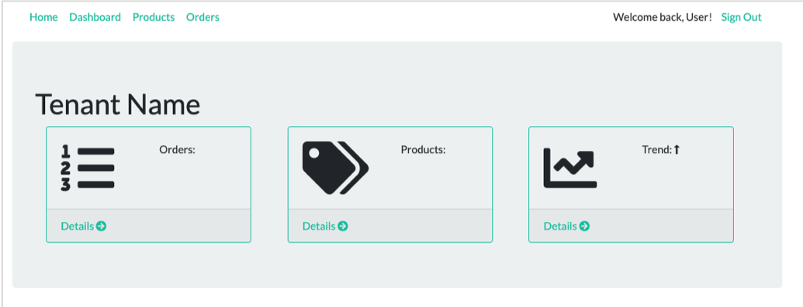
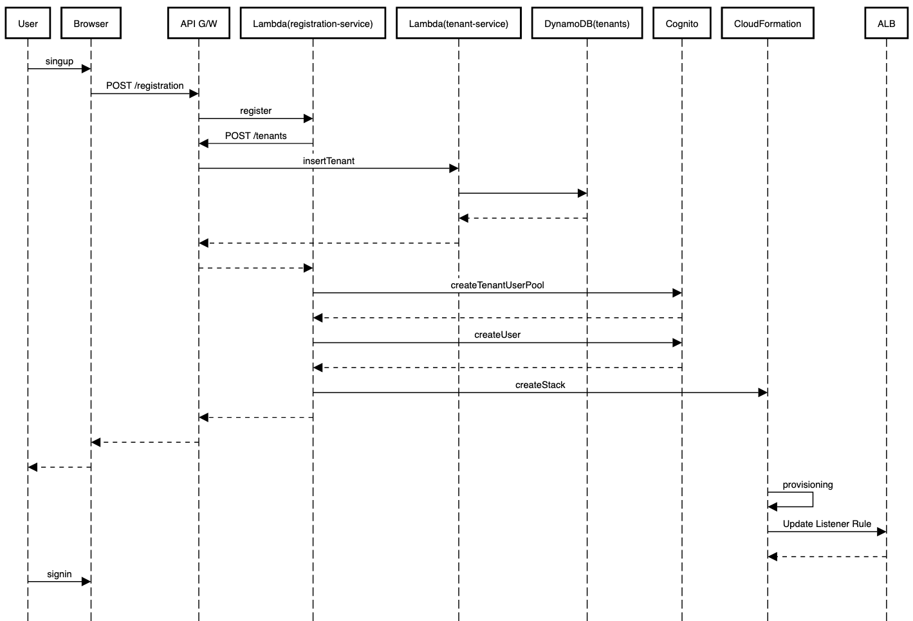

# Lab 2 – 온보딩, 아이덴터티 및 현대적 클라이언드

이제 모놀리식 애플리케이션을 준비했으므로 이 모놀리식 애플리케이션을 멀티 테넌트 모던 아키텍처로 변화 시키기 위해 무엇이 필요한지 살펴볼 차례입니다. 첫 번째 단계는 테넌트가 여러분의 시스템에 온보딩 하는 체계를 도입하는 것입니다. 이것은 우리가 모놀리식 애플리케이션에서 가지고 있던 간단한 로그인 메커니즘에서 벗어나 테넌트가 자동화된 프로세스에 따라 가입하고 등록할 수있는 체계를 도입하는 것입니다. 이 프로세스의 일부로, 테넌트 ID를 관리하기 위한 메커니즘도 도입할 예정입니다. 마지막으로 서버 측 webapp 계층에서 클라이언트 부분을 분리해 최신 React 클라이언트 애플리케이션으로 다시 만들어 S3로 옮기는, 새로운 클라이언트 환경도 만들 것 입니다.

이 워크샵은 온보딩 및 Identity 생성에 관한 세부 사항에 대해 자세히 다루지 않습니다. 관련한 내용은 다른 컨텐츠를 살펴 보시기를 추천 드립니다. React 클라이언트도 마찬가지입니다. 일반적으로 AWS에서 React 애플리케이션을 구축하고 호스팅하는 방식을 변경할 때 멀티 테넌트 관점에서 고려해야 하는 사항들이 많지는 않습니다. React에 관한 다른 다양한 자료를 살펴 보시기를 추천 드립니다. 이 워크샵에서는 마이크로서비스 마이그레이션 및 온보딩 자동화를 위해 채택할 전략에 중점을 두면서 단일 테넌트에서 다중 테넌트 마이크로서비스로 전환하는 과정을 살펴볼 것입니다.

다시 한번 강조하면, 우리는 온보딩, Identity에 관한 세부 사항과 어떻게 새로운 React 클라이언트를 만드는지 살펴 보기 보다 <b>어떻게 자동화된 온보딩 프로세스가 테넌트 별 리소스 생성을 오케스트레이션 하는지 살펴 볼 것 입니다</b>. 아래는 이에 대한 개념적인 아키텍처 입니다:

<p align="center"></p>

이제 시스템은 각 테넌트별로 별도의 애플리케이션 및 스토리지 레이어를 갖게될 것 입니다. 이런 아키텍처 모습은 코드의 일부를 모놀리식 애플리케이션으로 여전히 남겨 두지만 멀티 테넌트 방식으로 작동될 수 있게 해줍니다. 위 그림의 예시에서 Tenant 1 및 Tenant 2는 이미 온보딩 된 것으로 가정합니다. 새로운 S3 기반 호스팅 웹 애플리케이션은 API Gateway를 통해 이러한 테넌트의 애플리케이션 레이어와 상호 작용합니다.

문제는 모든 테넌트가 공유된 웹 환경을 통해 시스템에 액세스하기 때문에 테넌트 당 요청을 적절하게 사일로된 테넌트별 컴퓨팅 및 데이터베이스 리소스로 보내는 라우팅 개념을 도입해야 한다는 것입니다. 이는 각 테넌트별 요청의 헤더를 검사한 후 이미 등록된 각 테넌트별로 배포된 적절한 대상 그룹으로 그 트래픽을 라우팅하는 ALB(Application Load Balancer) 리스너 규칙을 통해 만들수 있습니다.

새로운 테넌트가 시스템에 추가되면 이 신규 테넌트만을 위한 새로운 애플리케이션 계층 인스턴스를 프로비저닝해야합니다(\*위 그림에서 Tenant 3으로 표시). 이 자동화 된 프로세스는 새 계층을 프로비저닝하고 Tenant 3에 대한 트래픽을 이 클러스터로 라우팅하도록 ALB 규칙을 구성할 것 입니다.

이 실습의 목표는 이 새로운 온보딩 자동화를 만들고 일부 테넌트를 등록하여 필요한 만큼 새 리소스가 할당되는지 확인하는 것입니다. 또한 Identity 와 온보딩 프로세스뿐 아니라, 멀티 테넌트 마이크로서비스로의 마이그레이션을 가능하게하는 Request 라우팅 메커니즘에 대해서도 자세히 살펴볼 것 입니다.

## 구현할 사항

시스템을 마이크로서비스로 분해하기 전에, 우리는 먼저 테넌시 개념을 우리 환경에 도입해야 합니다. 궁극적으로 새로운 Lambda 함수를 만드는 데 중점을 두겠지만, 새로운 테넌트 생성, 인증 및 테넌트 컨텍스트를 인증된 각 사용자에게 연결하는 핵심적인 메커니즘을 설정하는 것을 우선 시작해야 합니다.

이 실습의 핵심은 시스템을 멀티 테넌트 모델로의 순차적 마이그레이션 하는데 필요한 기반을 설정하는 온보딩 메커니즘을 배포하는 것입니다.즉, 이는 각각의 새로운 테넌트를 위한 사일로 형태의 자원 생성을 오케스트레이션하고 테넌트를 라우팅하기 위해 필요한 복잡한 요소를 만들 것입니다. 물론 모놀리식 애플리케이션에 대한 너무 많은 변경 없이 수행하고 싶습니다.

모놀리식 애플리케이션 계층을 마이크로서비스로 분해하기 위한 준비로 MVC 페이지 컨트롤러 아키텍처에서 REST API 기반 아키텍처로 이동할 것입니다. REST API를 통해 비즈니스 로직 서비스를 공개함으로써 우리의 마이크로서비스 모습과 현대적인 클라이언트 렌더링 (Modern Client-rendered) 웹 프론트엔드로 이동되는 모습도 함께 살펴 볼 것 입니다. 즉 서버에서 UI를 분리하여 브라우저에서 실행되는 React 애플리케이션으로 대체할 것 입니다. 이를 바탕으로 실습의 주요 부분을 정리하면 다음과 같습니다:

- 시스템이 각 테넌트에 대해 별도의 사일로 환경을 갖는데 필요한 새로운 인프라를 준비합니다. 여기에는 테넌트 컨텍스트를 활용하고 각 테넌트를 해당 인프라 스택으로 라우팅하는 새로운 메커니즘을 도입하는 것도 포함합니다.
- 테넌트가 등록되면 Cognito에서 User Identity를 생성하며 각 테넌트에 대해 새로운 별도 스택을 프로비저닝 할 수 있는 온보딩 및 Identity가 도입될 것 입니다. 이 부분은 멀티 테넌트 아키텍처 구현을 향한 첫 번째 핵심 사항 이며, 동시에 시스템을 진정한 Siloed SaaS 솔루션으로 실행할 수 있도록 인프라 프로비저닝을 자동화하고 테넌트 컨텍스트 개념을 도입할 수 있도록 할 것입니다.
- 애플리케이션 코드를 리팩터링하여 Lab 1에서 만든 MVC 모델에서 벗어나 REST API 형태로 전환 합니다. 즉, Lab 1에서 사용했던 컨트롤러를 API로 변환하고 해당 API를 API Gateway에 연결 합니다.
- 서버 측 렌더링 UI에서 최신 React UI로 마이그레이션하여 정적 JavaScript, CSS 및 HTML 코드를 S3 버킷으로 이동하고 서버에서 UI를 완전히 격리하기 위한 모범 사례를 도입 합니다. 이는 애플리케이션 계층으로부터 무엇이 만들어지고, 배포되고, 서비스로 제공되어져야 하는지 범위를 좁히기 때문에 마이그레이션 스토리의 핵심 부분이 됩니다.
- API Gateway를 통해 UI가 애플리케이션 서비스 (API)에 연결되는 방식에 대해 자세히 살펴봅니다.
- 새로운 UI를 사용하여 새 테넌트를 온보딩 하는 과정을 살펴 봅니다. 이때 주된 목표는 새로운 사용자 및 테넌트를 프로비저닝하는 방법을 이해하는 것입니다(\* 온보딩 과정에 있는 각 테넌트에 대해 새로운 애플리케이션 레이어(여전히 모놀리식)를 프로비저닝하는 것을 말함). 이를 통해 각 테넌트 서비스가 본래의 "레거시"코드를 바탕으로 사일로 형태의 멀티 테넌트 아키텍처 위에서 구동됩니다.

이런 기본 단계들을 완료하면 여러분은 Lab 3에서 모놀리식 애플리케이션 계층을 서버리스 형태로 마이그레이션 하기 위한 준비를 마칠 수 있습니다.

## 단계별 가이드

Lab 2 시작과 동시에 여러분은 실습 대상이 되는 모놀리식 애플리케이션의 핵심 요소에 대해 잘 파악해야 합니다. 왜나하면 이제 이를 모더나이즈 할 시간이기 때문입니다. 앞으로 이어지는 단계들은 여러분들에게 최신 UI 서비스를 위한 REST API 기반으로 기존 애플리케이션을 마이그레이션하는 과정을 보여줄 겁니다. 더불어 멀티 테넌트 온보딩, 테넌트 컨텍스트를 통한 인증 지원 및 테넌트 애플리케이션 계층의 자동화된 프로비저닝 과정을 소개할 것 입니다.

<b>Step 1</b> – 멀티 테넌시로 마이그레이션하는 첫 번째 단계는 각 테넌트 환경에 대해 별도의 사일로 환경을 가질 수 있는 아키텍처를 마련하는 것입니다. 초기 단일 테넌트 시스템은 단순히 _all_ 트래픽을 단일 고객의 단일 스택으로 라우팅하는 ALB를 통해 트래픽을 전달했습니다. 그러나 멀티 테넌시를 지원하기 위해 이제 애플리케이션 레이어들은 여러 인스턴스들을 갖게 될 것이며 여러분은 이제 이 아키텍처를 지원하기 위해 애플리케이션 스택 앞에 새로운 라우팅 인프라를 배치해야 합니다.

이 새로운 구성을 도입하려면 먼저 CloudFormation을 사용하여 이 실습의 환경을 구성하는 스크립트를 실행해야 합니다. 스크립트를 실행하려면 AWS 콘솔에서 Cloud9 서비스로 이동하여이 워크샵을 위한 IDE를 열고, 하단에 위치한 터미널 창으로 이동하여 다음 명령을 실행합니다:

```
cd /home/ec2-user/environment/saas-factory-serverless-workshop/resources
./lab2.sh
```

(참고) 아래 명령 실행 시에 "mvn: command not found" 메시지가 나타나면 Maven을 먼저 설치한 후 생성에 실패한 CloudFormation Stack을 삭제한 후 다시 생성합니다.<br>
```
sudo wget http://repos.fedorapeople.org/repos/dchen/apache-maven/epel-apache-maven.repo -O /etc/yum.repos.d/epel-apache-maven.repo
sudo sed -i s/\$releasever/6/g /etc/yum.repos.d/epel-apache-maven.repo
sudo yum install -y apache-maven
```

<b>Step 2</b> – 방금 실행한 인프라 배포의 상태를 살펴 봅니다. AWS 콘솔 내에서 CloudFormation 서비스로 이동합니다. 이름에 <b>lab2</b>가 포함 된 목록에서 스택을 찾습니다. 이 스택은 새로운 라우팅 인프라를 포함하여 멀티 테넌시를 지원하기 위한 인프라를 생성합니다. 화면은 다음과 유사해야합니다.

<p align="center"></p>

스택의 상태가 <b>CREATE_COMPLETE</b>가 될 때까지 기다려야 합니다. 이는 스택의 모든 요소가 생성되었음을 나타냅니다. 아직 완료되지 않은 경우 새로 고침 버튼 (페이지 상단의 삭제 버튼 바로 왼쪽)을 눌러 업데이트 된 상태를 가져옵니다.<br>
> <u>***다음 단계로 이동하기 전에 이 프로세스가 완료 될 때까지 기다려야합니다***.</u><br>
스택을 완료하는데 5분 정도 소요될 것 입니다.


<b>Step 3</b> – 멀티 테넌트 환경으로 이동하는 과정에서 모놀리식 웹 UI (모든 HTML이 앱 서버에서 렌더링되고 제공됨)를 Amazon S3에서 호스팅 되는 최신 UI 프레임워크로 마이그레이션하도록 결정했습니다. 이 결정이 사실은 SaaS로 마이그레이션하는 분들에 따라 다르게 받아들여질 수 있지만, 우리는 이 선택이 매력적인 전략이라고 느꼈고 이러한 마이그레이션이 최종적인 아키텍처 모습에 어떤 영향을 미치는지 설명하고 싶었습니다. 우리가 배포할 React 애플리케이션의 세부 사항은 본 실습의 범위를 벗어나지만 이 React 코드가 우리 아키텍처의 다른 서비스와 어떻게 상호 작용하는 이해하려면 코드를 주의 깊게 살펴 보는 것도 좋습니다.

현재 우리의 목표는 단순하게 이 새로운 UI를 배포하고 작동시켜 새로운 멀티 테넌트 모델과 상호 작용을 시작할 수 있도록 만드는데 있습니다. 이 작업을 단순화 하기 위해 React 애플리케이션을 빌드하고 S3 버킷에 복사하여 액세스할 수 있도록 셸 스크립트를 만들어 두었습니다. <b>계속하기 전에 lab2 CloudFormation 스택이 성공적으로 완료되었는지 확인해야합니다 </b>. 이 스크립트를 실행하려면 Cloud9 환경으로 이동하고 터미널 창에서 다음 명령을 입력하여 웹 클라이언트 배포 스크립트를 실행합니다:

```
cd /home/ec2-user/environment/saas-factory-serverless-workshop/resources
./website-lab2.sh
```

<b>Step 4</b> – 이제 스택이 생성되었으므로 앞서 소개한 인프라를 살펴 보겠습니다. 이 실습에서 구축 중인 새로운 다중 테넌트 모델에서 React 클라이언트에서 들어오는 각 요청에는 JWT 토큰에 테넌트 컨텍스트가 포함됩니다(이 실습의 뒷부분에서 어떻게 작동하는지 자세히 살펴 보겠습니다). API Gateway는 REST 리소스를 클라이언트에 노출하고 HTTP 헤더를 조작하여 Application Load Balancer가 요청을 적절한 테넌트 스택(사일로)으로 라우팅 할 수 있도록 합니다. 이 라우팅 작업을 수행하는 첫 번째 단계는 API Gateway를 구성하고 JWT 토큰에서 테넌트 컨텍스트를 추출하고 API Gateway가 프록시하는 다운스트림 리소스에 대한 요청 컨텍스트의 일부로 전달(노출)할 사용자 지정 권한 부여자(Custom Authorizer)를 연결하는 것입니다.

사용자 지정 권한 부여자는 API Gateway에서 처리하는 각 요청과 함께 호출되는 단순한 Lambda 함수입니다. 우리는 이 Lambda 함수 내에서 수신된 권한 부여 토큰(Authorization Token)을 검사하고 다음 이어질 다운스트림 처리를 위해 컨텍스트를 삽입 할 수 있습니다. 배포된 사용자 지정 권한 부여자를 보려면 AWS 콘솔에서 API Gateway로 이동합니다. 그리고 API 목록에서 <b>saas-factory-srvls-wrkshp-lab2</b>를 선택합니다. 그런 다음 이 API를 선택한 상태에서 왼쪽에 표시된 옵션 메뉴에서 <b>Authorizers</b>를 선택합니다. 이 옵션을 선택하면 다음과 유사한 페이지가 표시됩니다:

<p align="center"></p>

권한 부여자가 <b>Token</b> 유형의 이벤트 페이로드(Lambda Event Payload)를 기다리면서 특정 Lambda 함수와 연결되어 있음을 알 수 있습니다. 이 경우 함수는 <b>saas-factory-srvls-wrkshp-lambda-authorizer-[REGION]</b>입니다. 또한 <b>토큰 원본 (Token Source)</b>가 Authorization 으로 설정되어 있습니다 (자세한 내용은 아래 참조).

<b>Step 5</b> – Lambda Authorizer에 대해 자세히 알아볼 시간입니다! 이 Lambda 함수에 대한 코드를 열어 보겠습니다. Cloud9로 다시 이동하여 <b>resources/lambda-authorizer/src/main/java/com/amazon/aws/partners/saasfactory</b>에있는 <b>Authorizer.java</b> 파일을 엽니다.

<p align="center"></p>

여기 코드의 일부가 있습니다.

<p align="center"></p>

이는 일반적인 Lambda 요청 핸들러 메서드라는 점을 알아두면 좋습니다. 먼저 수신 <b>event</b>에서 <b>authorizationToken</b>을 구문 분석합니다. authorizationToken의 값은 API Gateway에 대한 권한 부여자를 설정할 때 <b>Token Source</b>에 의해 정의됩니다. 우리는 서명된 JWT 토큰이 포함 된 HTTP 요청에서 <b>Authorization</b> header를 선택했습니다. 토큰에서 테넌트 식별자를 추출한 후 응답 객체 (Response Object)의 <b>context</b>에 추가합니다.

<b>Step 6</b> - 이제 Lambda Authorizer가 HTTP Authorization 헤더의 서명된 JWT 토큰에서 테넌트 식별자를 추출하고 이를 요청 컨텍스트의 일부로 API Gateway에 전달했으므로 해당 값을 Resource Method의 <b>Integration Request</b>에 매핑할 수 있습니다. 이를 어떻게 하는지 살펴 보겠습니다. Amazon API Gateway 콘솔로 돌아가 <b>saas-factory-srvls-wrkshp-lab2</b> API를 선택한 다음 왼쪽 메뉴에서 <b>Resources</b>를 선택합니다. 이제 <b>/products</b> 리소스 아래에 나열된 <b>GET</b> 메소드를 클릭합니다. 화면은 다음과 유사해야합니다:

<p align="center"></p>

이제 API 메서드 실행 설정의 오른쪽 상단에 있는 파란색 <b>통합 요청 (Integration Request)</b>을 클릭합니다. <b>HTTP Headers</b> 옆에 있는 삼각형 모양을 확장하면 <b>X-Tenant-ID</b>라는 사용자 지정 헤더가 추가되고 해당 값이 <b>context.authorizer.TenantId</b>에서 매핑되도록 설정되었음을 알 수 있습니다. 이것은 Lambda 함수에서 AuthorizerResponse Object에 설정한 TenantId 속성입니다.

 <p align="center"></p>

<b>Step 7</b> – 이제 API Gateway가 헤더를 주입(추가) 했으므로 다음으로 살펴볼 부분은 이 헤더를 사용하여 트래픽을 각 스택으로 라우팅 하는 ALB 입니다. 여러분의 환경에 프로비저닝 된 ALB를 보려면 AWS 콘솔에서 EC2 서비스로 이동하고 페이지 왼쪽의 메뉴에서 <b>Load Balancer</b> 항목을 선택합니다 (아래로 이 메뉴 항목 찾기까지 스크롤 다운해야 합니다). <b>saas-wrkshp-lab2-[REGION]</b> 옆의 상자를 선택합니다. 페이지는 다음과 유사하게 나타납니다.

<p align="center"></p>

이 항목을 선택하면 페이지 하단의 <b>Listeners</b> 탭을 선택하여 이 ALB와 관련된 리스너를 볼 수 있습니다. 로드 밸런서에 정의된 단일 리스너가 확인될 것입니다. 현재 포트 80에서 들어오는 HTTP 요청을 수신하고 있습니다. 리스너 테이블의 "규칙" ("Rule") 열에 있는 <b>"1 rule"</b> 링크를 클릭하십시오. <u>**여기서 우리의 기대는 리스너 목록에서 트래픽을 적절한 대상 그룹으로 라우팅하기 위해 API Gateway에서 삽입 한 <b>X-Tenant-ID</b> 헤더를 적용하는 라우팅 규칙을 보는것입니다.**</u> 그러나 이 ALB에 대한 모든 요청에 대해 HTTP 401 Unauthorized 상태를 반환하는 기본 규칙만 있습니다. 왜 그럴까요? 아직 테넌트가 등록되지 않았기 때문입니다. ALB에는 최소한 하나의 리스너가 있어야 하며 리스너에는 최소한 기본 rule이 있어야 합니다. 그래서 우선 시스템을 보호하기 위해 unauthorized 에 대한 rule만을 추가했습니다. 멀티 테넌트 아키텍처에 대한 사용자 지정 라우팅 규칙은 각각의 새 테넌트들이 사일로 스택으로 프로비저닝하는 동안에만 추가가 됩니다. 따라서 우리는 일부 테넌트를 프로비저닝 한 후 다시 이곳으로 돌아와 ALB 구성이 어떻게 변경되는지 확인할 예정입니다.

<b>Step 8</b> – 새 React UI를 사용하려면 먼저 애플리케이션에 액세스하는 데 사용할 새 URL이 필요합니다. (이제 S3에서 호스팅되고 애플리케이션 서버에서 제공되지 않기 때문에). 애플리케이션의 URL을 찾으려면 AWS 콘솔에서 CloudFront 서비스로 이동해야합니다. 이 페이지에는 배포 목록이 표시됩니다. 원본 값이 <b>[StackID]-lab1-[RANDOM]-websitebucket-[RANDOM].s3-website-[REGION].amazonaws.com</b> 인 배포가 확인 되어야 합니다. <b>Domain Name</b> 값을 복사합니다. 이 값은 이 워크숍의 나머지 부분에서 클라이언트 응용 프로그램에 액세스하는 데 사용되므로 기록해 두는 것이 좋습니다.

<p align="center"></p>

<b>Step 9</b> – 이제 URL이 확인되었기 때문에 애플리케이션에 액세스하여 작동 여부를 확인할 수 있습니다. 메모한 URL을 입력하고 애플리케이션을 열어봅니다. 새로운 React 클라이언트가 가동 및 실행 중이며 S3 에서 호스팅되고 CloudFront에 의해 글로벌 엣지 로케이션에 캐시됩니다. 애플리케이션이 열리면 다음과 같은 화면이 나타날 것입니다.

<p align="center"></p>

보이는 화면(페이지)의 모습은 Lab 1에서 사용된 모놀리식 애플리케이션과 매우 유사합니다. 유사해 보이지만 Real-World 상황에서는 아마도 여러분들은 최신 UI 프레임워크로 새롭게 만드는 동안 전체적인 UI 디자인 역시 변경하실 것입니다.😎

<b>Step 10</b> – 이 새로운 멀티 테넌트 환경에서는 더 이상 단순한 로그인 프로세스를 사용할 수 없습니다. SaaS 시스템으로서 우리는 이제 테넌트가 등록 프로세스를 완료하여 서비스에 온보딩할 수 있도록 합니다. 이것은 마이그레이션에 대해 생각할 때 중요한 단계입니다. 왜냐하면 이를 통해 사용자는 멀티 테넌트 서버리스 아키텍처로 전환되었다는 사실을 인식하지 못하게 하면서 기본 구현을 마이그레이션 할 수 있는 기반을 마련할 수 있기 때문입니다.

애플리케이션의 오른쪽 상단에있는 "Sign up" 버튼을 선택하여 첫 번째 테넌트를 생성해 보겠습니다. 이 옵션을 선택하면 다음과 유사한 양식이 표시됩니다.

<p align="center"></p>

테넌트와 테넌트의 첫번째 사용자에 대한 값을 입력합니다 (이 워크숍에 실제 이메일 주소를 사용할 필요는 <u>**없습니다**</u>). 이 페이지는 새로운 테넌트 온보드 시 수집될 수 있는 공통 속성을 수집하는 단순한 SaaS 서비스 가입 페이지입니다. 만약 여러분의 조직이 이런 직접 가입(등록)을 지원하지 않을 경우 온보딩을 트리거 하면서 관련 정보도 수집할 수 있는 자동화 도구가 여전히 있어야 합니다. 다음 확인을 위해 가입 시 제공한 이메일 주소와 비밀번호를 기록해 두십시오.

<b>Step 11</b> - 등록 양식은 Registration Service에 의해 조정(orchestrated)되는 일련의 단계를 트리거 합니다. 즉 새로운 테넌트를 온보딩하기 위해 CloudFormation 스택이 시작됩니다. 콘솔에서 CloudFormation으로 이동하여 스택 상태를 확인하고 생성 중인 스택을 확인합니다. 이 스택은 새 테넌트에 대한 모든 사일로 인프라를 프로비저닝 하며 완료까지 몇 분 정도 걸립니다. <b>계속하기 전에 이 스택이 완료될 때까지 기다려야 합니다</b>.

<p align="center"><kbd></kbd></p>

<b>Step 12</b> - Lab 1과 마찬가지로 여러분은 이제 CI/CD 파이프라인을 트리거하여 모놀리스를 새 테넌트 용으로 생성된 사일로 인프라에 배포해야 합니다. CodePipeline으로 이동하여 <b>saas-factory-srvls-wrkshp-pipeline-lab2</b> 파이프라인을 클릭합니다. 현재 이 파이프라인은 실패 상태일 것입니다. 파이프라인을 클릭하면 아래와 같은 세부 정보 페이지로 이동합니다. 주황색 <b>Release Change</b> 버튼을 클릭하여 파이프라인을 시작합니다. <b>계속하기 전에 파이프라인의 3 단계가 모두 완료될 때까지 기다려야 합니다</b>.

<p align="center"><kbd></kbd></p>

<b>Step 13</b>- 파이프라인이 성공적으로 완료되면 새 테넌트가 해당 태넌트 만을 위해 마련된 스택에 완전히 온보딩 됩니다! 앞서 메모해 둔 CloudFront 도메인 이름으로 호스팅된 클라이언트 웹 애플리케이션으로 돌아가서 등록 프로세스 과정에서 입력한 이메일과 암호를 사용하여 로그인하겠습니다. 오른쪽 상단의 <b>Sign In</b> 버튼을 클릭하고 로그인 세부 정보를 입력하십시오. <b>Sign In</b>을 클릭하여 애플리케이션에 로그인하십시요.

<p align="center"><kbd></kbd></p>

<b>Step 14</b> – 우선 애플리케이션에 로그인하면 리테일 비즈니스에 대한 분석을 제공하는 대시보드 페이지 (Lab 1의 모놀리식 애플리케이션으로 확인한 것과 유사함)로 이동할 것 입니다. 페이지 상단에는 애플리케이션의 다양한 기능에 액세스 할 수 있는 메뉴 모음도 있습니다. 페이지는 다음과 같이 나타납니다.

<p align="center"></p>

<b>Step 15</b> – 이제 페이지 상단의 탐색에서 <b>Products</b> 항목을 선택하여 제품 페이지에 액세스 해보겠습니다. 그런데 이 테넌트가 방금 등록했고 카탈로그에 제품을 추가하지 않았기 때문에 페이지가 비어 있을겁니다. 화면은 다음과 같이 나타납니다.

<p align="center"><kbd></kbd></p>

<b>Step 16</b> – <b>Add Product</b> 버튼을 클릭하여 새 제품을 만듭니다. 이 옵션을 선택하면 다음과 같이 제품 정보를 입력할 수있는 양식이 표시됩니다.

<p align="center"></p>

Lab 1에서 했던 것처럼 제품 정보를 입력하고 <b>Add Product</b>를 선택하여 제품 정보를 저장합니다. 그런 다음 새 제품이 추가되었음을 확인할 수 있는 제품 목록으로 돌아갑니다. 참고로 Lab 4에서 추가적인 제품 정보를 사용하므로 제품을 두 개 이상 추가합니다.

<p align="center"></p>

<b>Step 17</b> – 이제 테넌트와 일부 제품을 시스템에 성공적으로 추가했으므로 시스템이 각 테넌트에 대해 프로비저닝 한 내용과 개별 테넌트를 그들 각각의 사일로 스택으로 연결되도록 라우팅이 어떻게 구성되었는지 자세히 살펴볼 수 있습니다. 테넌트가 Amazon Cognito(사용자를 인증하고 시스템을 통한 테넌트의 흐름을 제어하는 필수 JWT 토큰을 제공함)에 프로비저닝 된 방법을 살펴봄으로써 이 프로세스를 시작합니다.

AWS 콘솔 내에서 Cognito 서비스로 이동합니다. 이번 예에서는 각 테넌트에 대해 별도의 사용자 풀(User Pool)을 프로비저닝합니다. 이러한 풀(Pool)을 사용하면 각 테넌트에 대해 별도로 정책을 그룹화하고 구성 할 수 있습니다. 방문 페이지에서 <b>Manage User Pools</b>를 선택하면 다음과 유사한 사용자 풀(User Pool) 목록이 표시됩니다.

<p align="center"></p>

시스템에 새 테넌트를 추가 할 때마다 새 Cognito 사용자 풀(User Pool)이 생성됩니다. 이번에는 테넌트를 하나만 추가 했으므로 풀(Pool) 이 하나만 있어야 합니다. 사용자 풀(User Pool) 페이지에서 해당 풀(Pool)을 선택합니다. 그러면 풀(Pool) 구성에 대한 요약이 제공될겁니다. 이제 페이지 왼쪽에서 <b>User and groups</b>을 선택하여 현재 이 풀(Pool)에 속하는 사용자(User)를 확인합니다. 해당 페이지는 다음과 같이 나타납니다.

<p align="center"></p>

여기에 테넌트를 만들 때 등록한 사용자(User)가 나열될 겁니다. 생성한 사용자(User)의 속성을 보려면 사용자 (User) 이름에 대한 링크를 선택합니다. 다음과 유사한 페이지가 나타납니다:

<p align="center"></p>

테넌트 사용자 풀(User Pool)을 프로비저닝 할 때 특정 테넌트에 대한 이 사용자(User)의 관계를 추적할 수있는 특정 속성을 구성했습니다. 이는 사용자(User)에 대한 <b>custom:tenant_id</b> 과 같이 커스텀(Custom) 속성으로 표시됩니다. <b>이 테넌트 식별자는 이제 사용자의 인증 프로세스로부터 반환되는 JWT 토큰에 포함되며 인증 이후 이어지는 서비스와의 모든 상호 작용에 포함되어 전달되어질 것입니다.</b>

<b>Step 18</b> – 여기까지 우리는 JWT 토큰에 포함된 테넌트 식별자를 식별하고, API Gateway 사용자 지정 권한 부여자(Custom authorizer)가 이를 테넌트 컨텍스트로 주입하는 방법을 확인했습니다. 그러나 ALB 설정을 확인했을 때 아직 테넌트가 온보딩하지 않았기 때문에 테넌트에 대한 라우팅 규칙이 없었습니다. 이제 테넌트가 있으며 이 새 테넌트에 대한 라우팅을 지원하도록 ALB가 어떻게 구성되었는지 다시 살펴 볼 수 있게 되었습니다! 이 새로운 정보를 보려면 다시 AWS 콘솔에서 EC2 서비스로 이동하고 페이지 왼쪽에서 <b>Load Balancers</b>를 선택 하세요.그러면 다음과 유사한 로드 밸런서 목록이 제공될 것입니다.<br>

<p align="center"></p>

목록에서 <b>saas-wrkshp-lab2-[REGION]</b> 로드 밸런서를 선택합니다. 이제 페이지를 아래로 스크롤해 ALB의 <b>Listeners</b> 탭을 선택합니다. <b>"2 rules"</b> 링크를 클릭하면 테넌트의 라우팅을 제어하기 위해 특별히 추가된 규칙이 표시됩니다. 이 전달 규칙은 기본 401 승인되지 않은 규칙보다 높은 우선 순위로 설정됩니다. 화면은 다음과 유사하게 나타납니다:

<p align="center"></p>

이 규칙은 사용자 지정 권한 부여자(custom authorizer)를 통해 사용자 요청에(request) 삽입 한 X-Tenant-ID 헤더의 값을 검사하고 해당 테넌트의 인프라 스택에 해당하는 대상 그룹으로 그 요청을 전달합니다. 새 테넌트가 추가될 때마다 이 목록에 새 규칙이 도입됩니다.

<b>Step 19</b> – 온보딩 프로세스는 라우팅 구성 외에도 각 테넌트에 대해 별도의 격리된 컴퓨팅 리소스 세트를 프로비저닝했습니다. ASG(Auto Scaling Group)으로 구성된 이 클러스터는 애플리케이션 서비스 부분을 계속 실행합니다. EC2 인스턴스와 데이터베이스를 자세히 살펴보면 별도의 인스턴스와 각 테넌트용으로 프로비저닝된 별도의 데이터베이스가 있음을 알 수 있습니다. 우리는 이 부분을 너무 깊게 살펴 보지 않을 것입니다. 그러나 이는 향후 마이크로서비스로의 점진적 이동을 가능하게 하는 모델의 중요한 요소임을 기억해주세요.

현재까지 생성된 내용을 더 잘 이해하기 위하여 필요한 EC2 리소스를 간략히 살펴 보겠습니다. 콘솔에서 EC2 서비스로 이동하고 페이지 왼쪽에 있는 메뉴에서 <b>Instances</b> 옵션을 선택합니다. 이 인스턴스 목록에는 새 테넌트 용으로 프로비저닝 된 인스턴스를 나타내는 <b>saas-factory-srvls-wrkshp-lab2-[TENANT_ID]</b> 이라는 이름의 인스턴스가 표시됩니다. 다른 테넌트를 온보딩 시키면 해당 테넌트를 지원하기 위해 여기에 더 많은 인스턴스가 추가되는 것을 볼 수 있을 것입니다.

<p align="center"></p>

<u>***Consideration: 티어별 인스턴스 타입을 달리하는 문제 - Tenant Tiering***</u>

<b>Step 20</b> – 멀티 테넌트 모델을 지원하기 위해 인프라 및 온보딩이 어떻게 변경되었는지 확인했으므로 이제 새로운 React 클라이언트, API Gateway 및 모든 사일로 테넌트안에 연결된 프록시된 애플리케이션 서비스를 살펴 보겠습니다. 위에서 캡처한 CloudFront URL을 사용하여 웹 클라이언트로 돌아가서 새 테넌트를 등록할 때 사용한 이메일 주소와 암호로 로그인해 보겠습니다.

로그인하면 대시보드 홈 페이지로 이동할 겁니다. 네비게이션 헤더에서 <b>Products</b> 링크를 클릭하여 제품 카탈로그 목록 페이지로 이동하십시오. 제품 목록이 비어있을 수 있습니다. 카탈로그에 몇 가지 제품을 추가해 주세요.

이제 제거하려는 제품 행의 오른쪽에 있는 빨간색 <b>Del</b> 아이콘을 선택하여 제품을 삭제하십시오. 제품을 정말로 삭제할 것인지 묻는 확인 대화 상자가 표시됩니다. <b>Delete Product</b> 버튼을 클릭합니다. 아무 반응이 없습니다! 왜 그럴까요? 디버깅 할 시간입니다.

<b>Step 21</b> - React 애플리케이션의 일부 코드를 살펴보고 클라이언트에서 서버까지의 흐름을 추적해 보겠습니다. 이 코드를 얻으려면 AWS 콘솔에서 Cloud9를 다시 열고 이 워크샵을 위한 IDE 환경을 열어야 합니다. 왼쪽 탐색 창에서 <b>lab2/client/src/components/products/actions</b> 폴더를 엽니다. 내용을 보려면 <b>index.js</b> 파일을 두 번 클릭하십시오. 이 파일에서 하단에 다음과 같이 나타나는 <b>deleteProduct</b> 함수를 찾을 수 있을 겁니다.

```javascript
export const deleteProduct = (product) => {
  return function (dispatch) {
    const url = `/products/${product.id}`;
    const instance = createAxiosInstance();

    dispatch(closeModal());

    /*
        instance.delete(url, { data: product })
            .then(response => {
                const deletedProduct = response.data;
                if (deletedProduct && deletedProduct.id) {
                    dispatch(deleteProductFinished(deletedProduct));
                } else {
                    dispatch(errorModal("The product was not deleted."));
                }
            }, error => console.error(error))
            .then(() => {
            }, error => console.error(error));
        */
  };
};
```

이 함수는 클라이언트가 제품 서비스의 DELETE REST 메소드를 실행하고자 할때 호출됩니다. 여기서 이 메서드의 실제 호출이 비활성화 되어 있음을 알 수 있습니다. 애플리케이션에서 이 끊어진 호출 경로를 복구하는 첫 번째 단계로 호출을 수행하는 코드 블록의 주석 처리를 제거해야 합니다. 주석 마커를 제거하고 Ctrl-S 키보드 단축키를 사용하거나 Cloud9의 <b>/File</b> 메뉴에서 <b>Save</b>을 선택하여 파일을 저장합니다.

<b>Step 22</b> – 이제 클라이언트 코드를 수정했으므로 변경 사항을 서버에 적용하려면 이를 다시 S3에 배포해야합니다. Cloud9 IDE를 사용하여 터미널 창으로 이동하고 다음 명령을 실행하여 클라이언트 코드를 다시 배포합니다.

```
cd /home/ec2-user/environment/saas-factory-serverless-workshop/resources
./website-lab2.sh
```

<b>Step 23</b> – 이제 애플리케이션으로 돌아가서 제품 삭제를 다시 시도해 보겠습니다 (위에서 사용한 URL 및 자격 증명 사용). <b><i>웹 브라우저를 새로 고침</i></b>하여 방금 수정한 JavaScript의 새 사본을 강제로 가져오도록 합니다. 이제 React 클라이언트가 삭제 작업을 실행할 수 있게 되었습니다. 그러나 변경 사항에도 불구하고 삭제는 여전히 작동하지 않습니다.

<p align="center"></p>

이는 API Gateway가 여전히 백엔드 애플리케이션 계층 서비스에 연결하도록 설정되어 있지 않기 때문입니다. 이 문제를 해결하려면 콘솔에서 API Gateway 서비스를 열고 목록에서 <b>saas-factory-srvls-wrkshp-lab2</b> API를 선택해야 합니다. 그러면 시스템의 REST API를 정의하는 다양한 리소스가 표시됩니다. 리소스 목록에서 다음과 같이 <b>/products</b> 리소스를 찾습니다.

<p align="center"></p>

문제 해결을 위해 이 리소스에 정의된 DELETE 메소드를 고쳐야 합니다.이를 위해 DELETE 를 선택하십시오.

<b>Step 24</b> – DELETE 를 선택하면 , 아래와 같이 나타나는 화면에서 해당 메소드의 상세 설정 정보를 확인할 수 있을 것입니다.:

<p align="center"></p>

<b>Step 25</b> – 다음은, 상단 오른편에 나타나는 <b>Integration Request</b> 를 클릭하세요. Integration Request 는 우리의 DELETE 메소드에 대한 매핑 정보를 설정합니다. 이 옵션을 고르면 여러분은 아래와 유사한 화면을 보실 겁니다:

<p align="center"></p>

<b>Endpoint URL</b> 옆에서 경고 아이콘을 보실 수도 있습니다. 이것은 우리의 Endpoint URL이 아직 유효하지 않다는 것입니다. 관련된 Endpoint URL 값을 조정하기 위해 연필 모양의 아이콘을 선택하세요. Endpoint 값에 <b>/{id}</b> 경로를 더하고 저장을 위해 작은 체크 아이콘을 선택하세요.

<p align="center"></p>

이제 Endpoint URL에 경로 변수 (제품 ID)에 대한 자리 표시자가 있으므로 API Gateway에 이를 요청에 매핑하는 방법을 알려 주어야 백엔드 애플리케이션 계층으로 제대로 전달됩니다. 캐럿/삼각형을 클릭하여 <b>URL Path Parameters</b> 섹션을 확장합니다. <b>경로 추가 (Add path)</b> 링크를 클릭하고 매개 변수의 <b>Name</b>에 <b>id</b>를, <b>Mapped from</b>에 <b>method.request.path.id</b>를 값으로 입력합니다. 변경 사항을 저장하려면 <b>작은 확인 아이콘을 클릭</b>해야 합니다. 이것으로 삭제 동작이 정상 작동되도록 고쳐졌습니다.

<p align="center"></p>

<b>Step 26</b>- 수정 사항이 적용되는 것을 확인하려면 먼저 API를 다시 배포해야 합니다. 화면 상단의 리소스 목록 위에 있는 <b>Actions</b> 드롭다운 메뉴에서 <b>API 배포 (Deploy API)</b>를 선택합니다.

<p align="center"></p>

<b>배포 스테이지 (Deployment stage)</b>로 <b>v1</b>을 선택하고 <b>배포 (Deploy)</b> 버튼을 클릭합니다.

<p align="center"></p>

<b>Step 27</b> – 변경 사항이 적용되었는지 확인하려면 서버리스 클라이언트 애플리케이션 (위의 URL 사용)으로 돌아가 제공된 자격 증명으로 로그인합니다. 이제 제품 삭제를 시도하면 앞선 변경 사항으로 문제가 해결되었음을 알 수 있습니다.

<b>Step 28</b> – 마지막으로 API API Gateway로의 이동과 새로운 UI 모델이 애플리케이션 서비스 구현에 어떤 영향을 미쳤는지 주목할 필요가 있습니다. 우리의 목표는 모놀리스 코드의 변경을 최소화하는 것이지만 클라이언트와 모놀리스 간의 상호 작용은 MVC 모델에서 REST 기반 API로 변경되었습니다. 즉, API Gateway를 통해 호출되는 REST API를 노출하려면 MVC의 컨트롤러 부분을 리팩터링해야 했습니다.

이러한 변경 사항을 보려면 AWS 콘솔에서 Cloud9 서비스로 이동하여 IDE를 엽니다. 왼쪽 창에서 <b>lab2/server/src/main/java</b> 폴더를 엽니다. 그러면 Java 패키지 이름에 해당하는 일련의 폴더가 열립니다. <b>saasfactory</b> 폴더 아래에 우리의 서비스를 위한 새로운 REST API가 있는 <b>api</b> 폴더가 있습니다. <b>Products.java</b> 파일을 두 번 클릭하여 편집기에서 API를 엽니다. 다음은 이 파일의 코드 일부 입니다.

```java
@CrossOrigin
@GetMapping(path = "/products/{id}")
public Product getProduct(@PathVariable Integer id) throws Exception {
    logger.info("Products::getProduct id = " + id);
    return productService.getProduct(id);
}

@CrossOrigin
@GetMapping(path = "/products")
public List<Product> getProducts() throws Exception {
    logger.info("Products::getProducts");
    return productService.getProducts();
}
```

이 코드는 컨트롤러의 코드와 유사하지만 여기서 REST API 진입 점을 선언하는 annotation이 도입 되었음을 알 수 있습니다. 페이지 컨트롤러와 마찬가지로 이 코드는 서비스 클래스의 비즈니스 로직에 위임하지만 HTML 템플릿 프레임 워크와 통합하는 대신 이제 이 메서드는 HTML 렌더링을 담당하는 클라이언트에 JSON 문자열을 직접 반환합니다. 또한 리소스 폴더의 컨트롤러 클래스 나 HTML 템플릿이 더 이상 필요하지 않음을 알 수 있습니다.

## 시퀀스 다이어그

<details>
<summary>Onboarding Flow</summary>
<div markdown="1">
<p align="center"></p>
</div>
</details>
<!--
https://sequencediagram.org/index.html#initialData=A4QwTgLglgxloDsIAICqBnApmAUKSs8ISyAQmAPYDuWu+0ciKAggAoCSyA4gPQDqecAyIkAMiAC2AIwAmIABRhMAcyjoIYENAoIAtLQBusTAEpBBRsRTjpc+REwIr+7EZinzwpsgAiATycJCh9Se0crdDN6Qm8AYQplBCgICk8Yq2RYgBsKAFcZADEKMAktKB00yxJmUVIcHEcNP3RQOARlZAAGADoANnqMbF0APnJqWgAudCh23OAcMZoh4bZOXj4J1gB5AGUAFWQeJVV1TW0EHFXufhGbWQVjtQ0ynRcwN1MJx-VsHDu7b7Pc5vD4mEZXdabXYHHgOJxIdCXDjXPi3ST3MLwiAg4wmCYzWgQPbhJB-dF2OHOQy4kb+QLBUKUhF4nB0yQMzERMFo2wKJnY6nuFn-PkkgWuGng5GQpFrG48jGAs7lPSCz5k3mKFRPZWvNVg4bxRLJCgTGBKLSYYlYwZgVgUChZHBGpIpXQKgHa04vVUSoUTDWKr1AlU4oUjF0ms0Why250JV0Ud3DEVak4hvV+9WppU+sOmCM5fJFEo+6OYS07CAgGAAa1lKIAPO6c8Hdb73riA4taM3dBD+AHbX2e9gA9k8oViqVgYai1PS+cJsBKEZpjoZspnfOSzPQytahNUMA5A5kKIno5sMgAEq5LKYbeT3c+vs1UgBnC2kajsBTKDGggQA
-->

<details>
<summary>Basic Flow</summary>
<div markdown="1">
<p align="center"></p>
</div>
</details>
<!--
https://sequencediagram.org/index.html#initialData=A4QwTgLglgxloDsIAICqBnApmAUKSs8ISyAQmAPYDuWu+0ciKAwgDYUCuAJgGKVJ5wDIiQDKAZkEFGxFAEEACgElkAcQD0AdSnCmyADIgAtgCMuIABQgOEABYBaWgDdYmAJQ7Ce5hQDmCKAgKTxkSQ1NzKxtbCjAoAC9sD3ovWWQ5fVIQkRQAJUx0CB8kSlZWbGy9UWwXGExKtIAREGCU0LzGrJxMEoBPdFA4BF9kAAYAOgA2HBwMbHsAPnJqWgAudChhzZxlmnmFtk5efghVtQBRABVkdQAPe-HbCCNWHEPuPgokRYlVnAl7It3scvqc3uwPidAUtKHswGcABKXACy+mQ+QGXywO1htEWihUGk0qwUAHlRNd1NY7DgCWotItwmZLNSHM5XG4znJoj0GCBoF8cEzIqzHDUOUC-AEgn8fP5AhRocKWdExWBau4-sqonY1Rq3NC6UTVgApTTXS4UADWPVpynpmmhuzWJtEpIAcuiCsAsZgADoIKiBWzIM0W622537KPw5CiEBOTCh83IS02hDIAObOMFDZfONBMAgXz1GPQuax2Z4mErbDrTDgGAh4CULgcGAQANYRsh2JcbDIcZDnG1sCLGOraryaKxBL8qD5hEN-tgTOB4PJ8Ppkdw-H242qK43FsUNsd9ABw+UvvYC-ruyb1MRhB2wkMhba1mzxJgTnpGdxPE86Cp+AEJEkhr7loZyvg6e5vsSOYoJcPSyEoXBrtmS4gCusFEvimR-BkpAEaQqy5Jw0DDMgJi9GuKEIGhGHYbhxGLBiRSgqU5SVhxxQQNx+zVOqrh-MJGqLM0FB-FJ7GdH8uSdNCUkyS00LiaJ-zinU0J8VxFBlHWtKZAAPICeklAZPFEVBmhmfYxE2QhTq4nWroel6mIINiZY1nCiIomi+QICumy+DueKLBWMFAA
-->

## 리뷰

서버리스 SaaS 마이크로서비스로의 마이그레이션을 위해 많은 노력을 기울인 것처럼 느껴지지 않을 수도 있지만, Lab 2에서 수행된 작업은 개별 마이크로서비스로 분리하는 작업을 위한 기초 공사 가운데 하나 입니다.

Lab 2 에서는 모놀리식 애플리케이션을 크게 변경하지 않고 모든 멀티 테넌시를 배치했습니다. 테넌트 컨텍스트를 환경에 도입할 수 있도록 Onboarding 및 Identity를 도입 했습니다. 또한 모든 자동 프로비저닝을 체계를 생성하여 각 테넌트에 대해 별도의 컴퓨팅 및 스토리지를 사용하여 각 테넌트에 대한 사일로 모놀리스 인스턴스를 생성했습니다.

이 모든 것의 핵심은 우리 시스템이 클라이언트에서 각 테넌트 스택으로 호출을 라우팅 할 수있는 라우팅 레이어를 만드는데 있었습니다. 마지막으로 S3에서 제공되는 React 애플리케이션을 도입하여 최신 UI 모델로 전환했습니다. 이 새로운 클라이언트 모델을 만듦으로써 우리는 서버리스 마이크로서비스를 만들기 시작할 때 노력을 간소화하고 집중할 수 있습니다. 이를 통해 더 이상 서버 렌더링 HTML에 대한 걱정으로 서비스가 복잡해지지 않을것 입니다.

여기까지 Lab 2를 완료 했습니다.

[Lab 3 계속하기](../lab3/README.md)
