# Lab 3 – 첫번째 멀티 테넌트 서버리스 마이크로서비스 분리하기

이제 자동화 된 온보딩 프로세스와 멀티 테넌트 Identity가 준비 되었으므로 모놀리식 애플리케이션을 멀티 테넌트 마이크로서비스로 변경하는데 보다 집중을 해보겠습니다! 우리의 목표는 모놀리식 애플리케이션에서 개별 서비스, 기능을 분리 추출하는 동시에 애플리케이션의 일부가 모놀리식 아키텍처에 남아있는 동안 멀티 테넌트 서버리스 마이크로서비스들이 사용자에게 서비스될 수 있도록 하는 메커니즘을 만드는 것입니다.

이 매커니즘의 핵심 부분은 마이크로서비스 및 모놀리식 서비스가 병렬적으로 실행 가능하도록 라우팅 체계를 준비하는 것입니다. 여기서 아이디어는 서비스에 대한 단일 통합 API를 바탕으로 트래픽을 적절한 대상 서비스 (Lambda 함수 또는 모놀리스의 진입점)로 라우팅한다는 것입니다. 다음 다이어그램은 이 첫번째 서비스를 구성하기 위해 선택한 접근 방식에 대한 개념적 모습입니다.

<p align="center"></p>

이 다이어그램에서 테넌트에 대한 두 개의 별도 경로가 있음을 확인할 수 있습니다. 테넌트가 API Gateway로 들어가면 새로운 주문 서비스로 (마이크로서비스로 분리 추출된) 라우팅되거나 모놀리식 애플리케이션 계층으로 라우팅 될 수 있습니다. 새로운 마이크로서비스 (Lambda 함수)와 애플리케이션 계층을 사용하는 경우 흐름이 달라진다는 점에 유의해야 합니다. 주문 서비스는 풀 기반 (Pooled) 멀티 테넌트 서비스이므로 모든 테넌트에 대한 요청을 함께 처리합니다. 한편, 모놀리식 애플리케이션에는 각 테넌트에 대한 별도의 배포 체계가 여전히 필요합니다. 즉, 사일로화된 모놀리식 애플리케이션들에는 트래픽을 적절한 애플리케이션 계층으로 전달하기 위한 추가적인 라우팅 규칙도 필요합니다 (Application Load Balancer 라우팅 규칙 사용).

이 실습에서는 상기 개념적 아키텍처를 구현할 것입니다. 이를 위해 서버리스 모델을 바탕으로 새로운 멀티 테넌트 주문 서비스를 배포할 것입니다. 우리는 주문 서비스를 위한 언어로 Java를 그대로 사용합니다. 물론 서버리스 모델에는 다양한 언어가 사용될 수 있습니다! ***(선택에 영향을 줄 수있는 다양한 요인이 있습니다)*** 하지만 여기서는 실습의 목적상 그대로 Java를 사용합니다.

일반적으로 모놀리식 애플리케이션에서 서비스를 분리하는 과정에서 논리적인 하나의 마이크로서비스를 나타내는 클래스 파일을 만들 겁니다. 여기서 아이디어는 모놀리식의 "서비스" 레이어 코드와 마찬가지로 솔루션의 다른 메서드를 가진 클래스를 계속 보유한다는 것입니다. 그런 다음 클래스의 다양한 메서드들을 개별 Lambda 함수로 배포합니다. <b>이 모델을 사용하면 코드의 큰 변경없이 모놀리스에서 마이크로서비스로 쉽게 이동할 수 있습니다.</b> <u>사실 이런 방식의 변경은 우리가 이미 모놀리식을 서비스에 대한 명확한 개념을 가지고 만들었기 때문에 상대적으로 수월하게 가능하지만, 대부분의 경우 모놀리식 애플리케이션은 이처럼 깔끔하게 분리되지 않을겁니다😭. 이럴 경우에는 어떻게 현행 소스 코드를 분해할 힌트를 얻을 수 있을까요? - (예) 소스 코드 분석 솔루션 (CAST, CodeMR, 데브온 MSA 스위트 등, APM 툴의 호출 분석 등)</u> 또한 이 서비스로 유입되는 테넌트 컨텍스트를 활용하여 데이터를 분할하고 로깅 컨텍스트를 추가하는 등의 작업도 더해져야 합니다.

한 가지 미리 알아 두어야할 사항은 이번 실습에서 데이터 마이그레이션 측면의 세부적인 사항은 깊이 살펴보지 않을 것입니다🙅🏻‍♂️. 물론 데이터 마이그레이션 역시 중요한 부분이지만 실습의 목적상 깊이 다루지 않습니다. 따라서 실습에서는 새로운 서비스를 쪼개고 새로운 멀티 테넌트 스토리지 구성을 도입할 때 Fresh 데이터베이스로 시작합니다. 즉, 모놀리식 데이터베이스에 존재하는 데이터를 그대로 남겨두기로 합니다.

## 구현할 사항

이 실습은 기존 애플리케이션 계층에서 첫 번째 서비스를 분리해 내는 것입니다. 또한 위에서 설명한 모델을 지원하기 위해 서비스가 인프라 내에서 배포되고 구성되는 방법을 살펴볼 겁니다. 다음은 실습의 핵심 내용을 요약한 것입니다.

- 첫 번째 단계는 주문 서비스를 구성하는 Lambda 함수를 실제로 생성하는 것입니다. Java 코드가 함수 기반 접근 방식으로 어떻게 변환되는지 검토하고 이러한 새로운 함수를 배포하는 기본 연습을 합니다.

- API Gateway는 모놀리식 애플리케이션과 분리된 마이크로서비스 계층을 함께 지원하기 위해 변경이 필요 합니다. API Gateway가 특정 주문 서비스 호출을 해당 서비스에 연결되는 Lambda 함수로 라우팅 하는 흐름을 살펴보고 Lambda 개발 흐름과 런타임 환경 등을 살펴 보겠습니다.

- 주문 서비스가 분리됨에 따라 해당 데이터가 멀티 테넌트 모델에서 어떻게 표현될 것인지도 고려해야 합니다. 더 구체적으로 말하자면 주문 서비스의 격리, 성능 및 확장 요구 사항에 가장 적합한 스토리지 기술을 선택하고 데이터 파티셔닝 체계를 도입해야 한다는 겁니다. 이러한 단계를 완료하면 완전한 서버리스 SaaS 모델로의 전환 모습을 이해하는데 도움이 될 겁니다. 하나의 서비스가 마이그레이션되면 이제 애플리케이션 계층에서 나머지 서비스를 분할하는 방법에 대해서도 생각해봐야 합니다. 이 부분에 대해서는 Lab 4에서 더 다룹니다.

## 단계별 가이드

다음은 서버리스 모델에 배포될 새로운 멀티 테넌트 주문 서비스를 만들기 위한 단계별 프로세스 입니다.

<b>Step 1</b> – 주문 서비스 코드를 찾는 것부터 시작하겠습니다. AWS 콘솔에서 Cloud9 IDE를 열고 <b>Serverless SaaS Workshop IDE</b>를 선택합니다. IDE를 사용하여 현재 주문 서비스에 대해 존재하는 코드를 검사할 수 있습니다. 이동하려면 페이지 왼쪽 창에서 <b>lab3</b> 폴더를 엽니다. <b>order-service/src/main/java</b>에서 주문 서비스를 구성하는 다양한 Java 파일을 찾을 수 있습니다. <b>OrderService.java</b>를 두 번 클릭하여 편집기 창에서 엽니다. 다음은 해당 파일의 일부입니다.

<p align="center">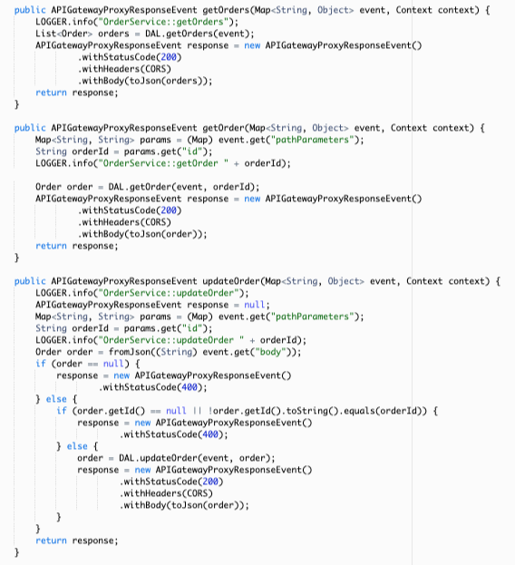</p>

이 클래스에는 주문 서비스의 CRUD 작업에 해당하는 일련의 Lambda 함수 이벤트 핸들러가 포함되어 있습니다.

<b>Step 2</b>-이제 새로운 마이크로서비스를 배포하고 실제로 작동하는지 살펴 보겠습니다. 이를 위해 우리는 마이크로서비스에 대한 변경 사항을 업로드 및 게시(또는 이 경우 처음 게시)하는 스크립트를 사용할 겁니다. 이 스크립트를 시작하려면 Cloud9 IDE의 터미널 창에서 다음 명령을 실행하십시오.

```
cd /home/ec2-user/environment/saas-factory-serverless-workshop/resources
./lab3.sh
```

이 스크립트는 CloudFormation 스택 생성을 트리거 합니다. <b>계속 진행 하기전에 아래와 같이 lab3 스택이 성공적으로 생성되었는지 확인하십시오.</b>

<p align="center">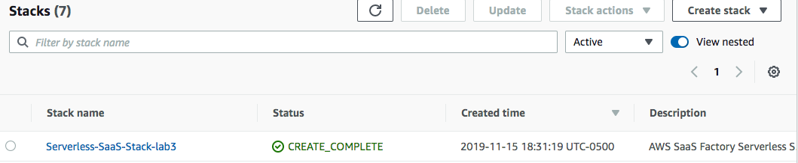</p>

<b>Step 3</b> - <b>계속하기 전에 lab3 CloudFormation 스택이 성공적으로 완료되었는지 확인해야합니다</b>. 이제 위에서 CloudFormation 스택의 일부로 생성된 새로운 엔드포인트를 사용하도록 React 클라이언트를 업데이트합니다. 다음 명령을 실행하여 웹 클라이언트를 업데이트하십시오.

```
cd /home/ec2-user/environment/saas-factory-serverless-workshop/resources
./website-lab3.sh
```

<b>Step 4</b> – 이제 새로운 주문 서비스가 배포되었는지 확인할 시간입니다. AWS 콘솔에서 Lambda 서비스를 엽니다. 모든 함수 목록이 표시됩니다. 함수 목록 위의 필터 상자에 <b>saas-factory-srvls-wrkshp-orders</b>를 입력하여 목록을 좁힙니다. 여기서 우리는 주문 서비스의 각 작업별로 별도 함수가 있음을 알 수 있습니다. 각각은 REST 작업 (GET, PUT, DELETE 등)에 해당합니다. 이것으로 우리 서비스가 배포되었음을 확인했습니다.

<p align="center">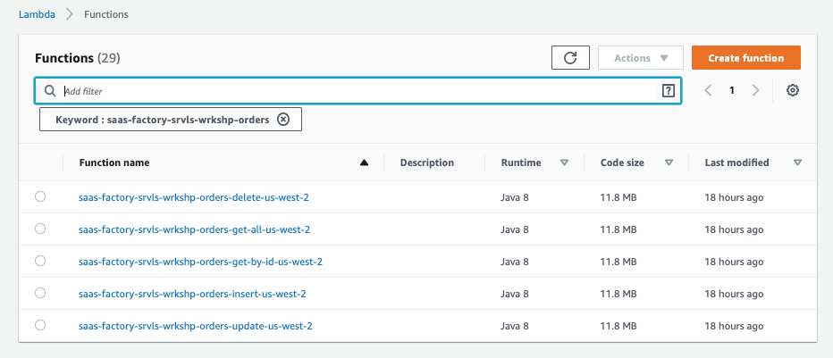</p>

<b>Step 5</b> – 자 이제 필요한 lambda 함수는 제 위치에 준비되었습니다👍🏻. 이제 API Gateway가 이전에 사용했던 모놀리식 애플리케이션 대신, 서버리스 마이크로서비스로 트래픽을 라우팅할 수 있도록 생성한 Lambda 함수에 entry point를 매핑했는지 확인해야 합니다. AWS 콘솔에서 API Gateway 서비스로 이동합니다. 목록에서 <b>saas-factory-srvls-wrkshp-lab3</b> API를 선택합니다. 그러면 다음과 같이 해당 API에 대해 구성된 리소스 목록이 표시됩니다.

<p align="center">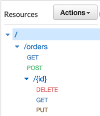</p>

여기에는 API Gateway에서 리소스로 활성화 된 기본 CRUD 작업이 표시됩니다. 매개 변수가 필요하지 않은 GET 및 POST 리소스가 있습니다. 또한 리소스에 식별자를 추가하여 개별 주문에 대한 GET, DELETE 및 PUT 작업을 활성화하는 /{id} 경로가 있습니다.

<b>Step 6</b> – 이제 이러한 REST 리소스 메서드가 이전에 사용했던 모놀리식 애플리케이션 대신 서버리스 마이크로서비스로 트래픽을 라우팅하기 위해 해당되는 Lambda 함수를 매핑했는지 확인할 수 있습니다. GET 주문 작업에 대한 구성에 액세스하려면 <b>/orders</b> 리소스 아래에서 <b>GET</b> 메서드를 선택합니다. 이 메서드는 Integration Reqeust type에 대해 <b>LAMBDA_PROXY</b>를 표시하는 것을 볼 수 있습니다. 다음과 유사하게 표시될겁니다.

<p align="center">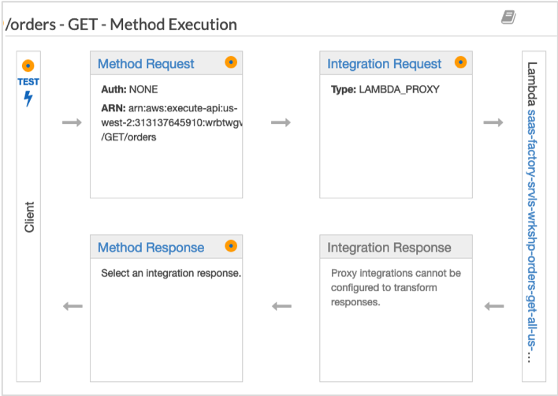</p>

<b>Step 7</b> – 마지막으로 올바른 Lambda 함수가 프록시되는 함수인지 확인할 수 있습니다. 오른쪽 상자 상단에서 <b>Integration Request</b> 제목을 선택합니다. 다음과 유사한 화면이 나타날 것입니다.

<p align="center">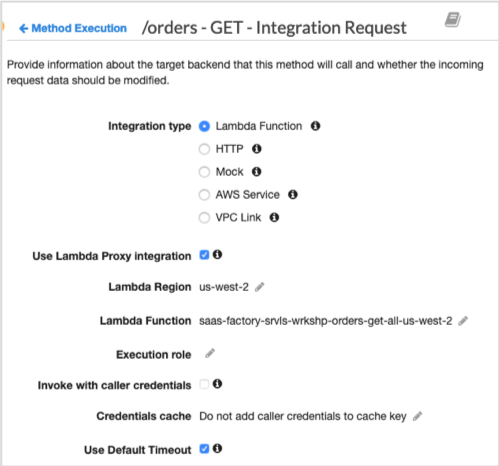</p>

여기서 핵심 정보는 Lambda 함수입니다. 이 속성의 값은 이전에 배포 한 getOrders() Lambda 함수에 직접 매핑되어야 합니다. 함수의 이름은 <b>saas-factory-srvls-wrkshp-orders-get-all-[REGION]</b>입니다.

<b>Step 8</b> – API Gateway 및 Lambda 함수가 제대로 설정되고 구성되었는지 확인했습니다. 이제 애플리케이션의 새로운 기능이 작동하는지 확인하겠습니다. 모놀리식 데이터베이스에서 주문 서비스에 대한 데이터를 의도적으로 마이그레이션 하지 않았으므로 빈 데이터베이스로 시작합니다.

최신 애플리케이션 용도로 이전에 저장한 URL을 사용하여 애플리케이션을 열고 이전에 생성한 테넌트 중 하나로 로그인합니다. 시스템에 주문을 추가하기 전에 카탈로그에 하나 이상의 제품이 있어야합니다. 탐색 헤더에서 <b>Products</b> 링크를 클릭하여 제품이 있는지 확인하십시오. 제품이 없는 경우 지금 추가해보세요.🙆🏻‍

<b>Step 9</b> - 이제 탐색 헤더의 <b>Orders</b> 메뉴 항목으로 이동하고 표시되는 페이지에서 <b>Add Order</b>를 선택합니다. 모의 주문 정보로 표시된 양식을 작성하고 <b>Add Order</b> 버튼을 선택하여 주문을 저장합니다. 아마도 에러가 발생할 겁니다. 무엇이 잘못되었는지 확인하기 위해 주문 서비스를 살펴 보겠습니다.

<p align="center">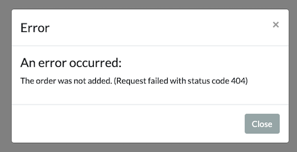</p>

<b>Step 10</b> – 먼저 주문 서비스의 코드를 살펴 보겠습니다. AWS 콘솔에서 Cloud9 IDE를 열고 <b>Serverless SaaS Workshop IDE</b>를 선택합니다. 왼쪽 창에있는 파일 트리를 사용하여 <b>lab3/order-service/src/main/java</b> 경로를 열어 주문 서비스를 구성하는 여러 클래스를 확인합니다. <b>OrderService.java</b> 파일을 두 번 클릭하여 해당 컨텐츠를 보고 Java 클래스 내에서 <b>insertOrder</b> 메소드를 찾으십시오. 메소드는 다음과 같이 나타납니다.

```java
public APIGatewayProxyResponseEvent insertOrder(Map<String, Object> event, Context context) {
    LOGGER.info("OrderService::insertOrder");

    APIGatewayProxyResponseEvent response = null;
    Order order = fromJson((String) event.get("body"));
    if (order == null) {
        response = new APIGatewayProxyResponseEvent()
                .withStatusCode(400);
    } else {
        // TODO Add code to call DAL.insertOrder here and return a 200
        response = new APIGatewayProxyResponseEvent()
                .withStatusCode(404)
                .withHeaders(CORS);
    }
    return response;
}
```

이 함수를 좀 더 자세히 살펴보면 함수가 실제로 완전하게 작성되지 않은 것을 알 수 있습니다. 실제로 주문 객체를 저장하기 위해 데이터 액세스 레이어를 호출해야한다는 메모가 주석으로 있습니다. 현재 이 메서드는 HTTP 404 오류를 반환합니다.

<b>Step 11</b> – insertOrder() 메서드가 작동하도록 하려면 주문을 데이터베이스에 삽입하는 코드를 추가해야 합니다. insertOrder 메소드가 다음과 일치 하도록 다음 코드를 복사하여 붙여 넣으십시오.

```java
public APIGatewayProxyResponseEvent insertOrder(Map<String, Object> event, Context context) {
    LOGGER.info("OrderService::insertOrder");

    APIGatewayProxyResponseEvent response = null;
    Order order = fromJson((String) event.get("body"));
    if (order == null) {
        response = new APIGatewayProxyResponseEvent()
                .withStatusCode(400);
    } else {
        order = DAL.insertOrder(event, order);
        response = new APIGatewayProxyResponseEvent()
                .withStatusCode(200)
                .withHeaders(CORS)
                .withBody(toJson(order));
    }
    return response;
}
```

이 코드는 수신된 요청으로부터 주문 데이터를 추출합니다. 주문이 비어 있으면 유효하지 않은 요청 상태 코드 400으로 반환됩니다. 그렇지 않으면 데이터 액세스 계층 (DAL)을 호출하여 주문을 데이터베이스에 삽입하고 상태 코드 200을 반환합니다.

<b>Step 12</b> – Ctrl-S 키보드 단축키를 사용하거나 Cloud9의 <b>File</b> 메뉴에서 <b>Save</b>을 선택하여 변경 사항을 저장해야 합니다. 새로운 코드가 도입 되었으므로 이제이 업데이트 된 함수를 Lambda 서비스에 배포해야합니다. 이 업데이트를 호출하려면 다음 명령을 실행하십시오.

```
cd /home/ec2-user/environment/saas-factory-serverless-workshop/lab3/order-service/
./update-service.sh
```

<b>Step 13</b> – 이제 insertOrder() 함수의 업데이트 된 버전이 준비되었습니다. 이전에 검색한 URL을 사용하여 애플리케이션을 다시 열고 이전에 사용한 테넌트를 사용하여 로그인 한 다음 메뉴에서 <b>Orders</b> 항목에 액세스 하겠습니다. 페이지에서 <b>Add Order</b> 버튼을 선택하고 표시되는 양식에 주문을 입력합니다. 주문 입력이 완료되면 양식에서 <b>Add Order</b> 버튼을 선택하십시오. 이제 페이지의 주문 목록에 주문이 표시되어 수정 사항이 제대로 작동하는지 확인해야 합니다.

<p align="center">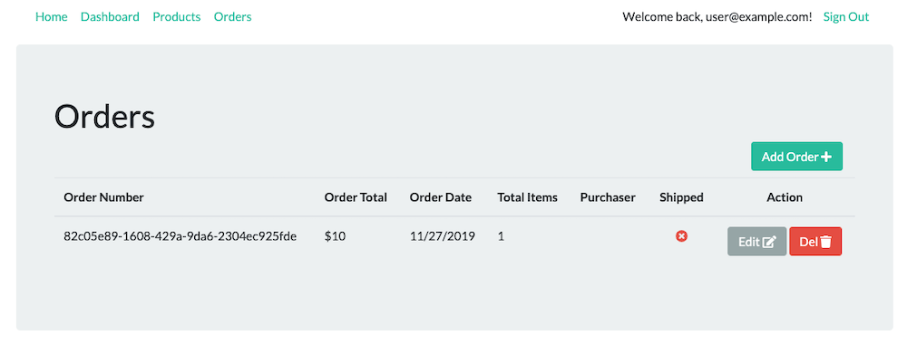</p>

<b>Step 14</b> – 이 새로운 마이크로서비스로 이동하는 과정에서 이전에 모든 서비스에서 함께 사용하던 데이터베이스에 대해 주문 서비스가 가지는 종속성도 제거해야 했습니다. 모놀리식 아키텍처로부터 데이터베이스를 분리하는 것 역시 마이크로서비스 전환 과정에서 필수적입니다. 각 마이크로서비스는 결합을(coupling) 제한하고 데이터 자율성(autonomy)을 확보하기 위해 관리하는 데이터를 직접 소유하는게 좋기 때문입니다. 이렇게 데이터베이스를 모놀리식과 분리하면 마이크로서비스 기반의 멀티 테넌트 요구 사항에 가장 적합한 서비스 및 멀티 테넌트 스토리지 전략을 결정할 수 있는 기회가 제공될 것 입니다.

이 실습에서는 주문 관리 마이크로서비스에서 관리할 주문 데이터를 운용하는 방법을 살펴봅니다. 이를 위해 먼저 각 테넌트에 대한 데이터를 사일로 (silo)해야 할까요? 풀링(공통 테이블/데이터베이스 공유) 해야 할까요? 격리 요구 사항은 무엇입니까? 같은 질문에 답을 할 수 있어야 합니다. 이번 실습 솔루션의 경우 주문 데이터를 DynamoDB로 이동하고 NoSQL 표현을 사용하기로 결정했습니다. 또한 격리상의 이유로 각 테넌트에 대해 별도의 테이블에 데이터를 저장하도록 선택할 수도 있습니다. 다음은 주문 서비스에 대한 데이터 표현의 개념적 모델입니다.

<p align="center">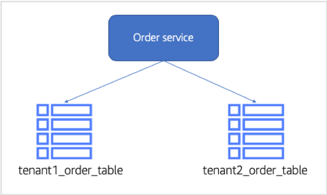</p>

이것이 실제로 작동하는지 확인하기 위해 이제 새로운 주문 마이크로서비스를 통해 추가된 데이터를 살펴 보겠습니다. AWS 콘솔에서 DynamoDB 서비스로 이동하고 왼쪽 탐색 창에서 <b>"Tables"</b> 항목을 선택합니다. 그러면 주문이 있는 테넌트의 테이블을 포함하여 DynamoDB 테이블 목록이 표시됩니다. 다음은 생성된 몇 가지 테넌트 테이블이 포함된 샘플입니다.

<p align="center">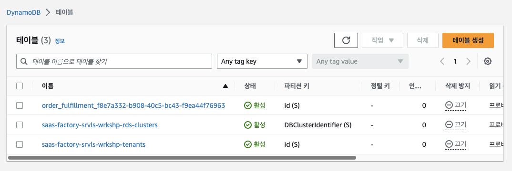</p>

[//]: # (여기에는 시스템의 각 테넌트 당 하나 씩 두 개의 테이블이 있습니다. 테이블 목록은 가입한 테넌트에 따라 다릅니다.)

<b>Step 15</b> – 이제 생성한 주문이 DynamoDB 테이블에 들어 갔는지 확인해야 합니다. <b>order_fulfillment\_[TENANT_ID]</b>라는 테이블을 선택합니다. 테이블을 선택하면 테이블에 대한 정보가 포함된 탭 목록이 있는 보기가 표시됩니다. 해당 테이블의 항목 목록을 보려면 <b>표 항목 탐색 (Explore table items)</b> 을 선택하십시오. 보기는 다음과 유사합니다.

<p align="center">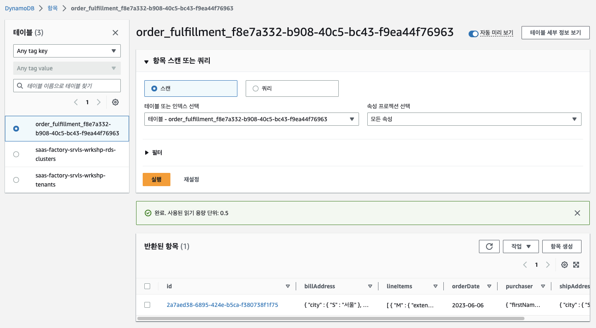</p>

이 예에서 테이블에는 하나의 주문 항목이 있습니다. 이 목록의 항목을 드릴하면 해당 항목에 대한 자세한 정보를 얻을 수 있습니다.

<b>Step 16</b> – 이 테이블 당 테넌트 파티셔닝 모델은 현재 테넌트 식별자 (JWT 토큰으로 전달됨)의 컨텍스트를 사용하여 테이블 이름을 생성합니다. 애플리케이션 서비스 코드에서 이것이 어떻게 식별되는지 살펴 보겠습니다. Cloud9의 Lab 3 주문 서비스 파일로 돌아갑니다. AWS 콘솔에서 Cloud9 IDE를 열고 <b>Serverless SaaS Workshop IDE</b>를 선택합니다. 왼쪽 창에 있는 파일 트리를 사용하여 <b>lab3/order-service/src/main/java</b> 경로를 열어 주문 서비스를 구성하는 여러 클래스를 확인합니다. <b>OrderServiceDAL.java</b> 파일을 두 번 클릭하고 <b>insertOrder()</b> 메소드를 보십시오. 코드는 다음과 같이 나타납니다.

```java
public Order insertOrder(Map<String, Object> event, Order order) {
    UUID orderId = UUID.randomUUID();
    LOGGER.info("OrderServiceDAL::insertOrder " + orderId);
    order.setId(orderId);

    try {
        Map<String, AttributeValue> item = DynamoDbHelper.toAttributeValueMap(order);
        String tableName = tableName(event);

        PutItemResponse response = ddb.putItem(request -> request.tableName(tableName).item(item));
    } catch (DynamoDbException e) {
        LOGGER.error("OrderServiceDAL::insertOrder " + getFullStackTrace(e));
        throw new RuntimeException(e);
    }

    return order;
}
```

이 메서드 내에서 <b>event</b> 매개 변수안의 요청 컨텍스트를 제공하는 <b>tableName</b>이라는 helper 메서드에 대한 호출을 볼 수 있습니다. 이 이벤트 매개 변수에는 테넌트 컨텍스트가 있는 JWT 토큰이 포함됩니다.

이 tableName 메소드 구현을 살펴 보겠습니다. tableName 메소드에 대한 구현을 찾을 때까지 OrderServiceDAL.java 파일에서 아래로 스크롤하십시오. 코드는 다음과 같습니다.

```java
private String tableName(Map<String, Object> event) {
    String tenantId = new TokenManager().getTenantId(event);
    String tableName = "order_fulfillment_" + tenantId;

    if (!tenantTableCache.containsKey(tenantId) || !tenantTableCache.get(tenantId).equals(tableName)) {
        boolean exits = false;
        ListTablesResponse response = ddb.listTables();
        for (String table : response.tableNames()) {
            if (table.equals(tableName)) {
                exits = true;
                break;
            }
        }
        if (!exits) {
            CreateTableResponse createTable = ddb.createTable(request -> request
                    .tableName(tableName)
                    .attributeDefinitions(AttributeDefinition.builder().attributeName("id").attributeType(ScalarAttributeType.S).build())
                    .keySchema(KeySchemaElement.builder().attributeName("id").keyType(KeyType.HASH).build())
                    .provisionedThroughput(ProvisionedThroughput.builder().readCapacityUnits(5L).writeCapacityUnits(5L).build())
            );
            waitForActive(tableName);
        }
        tenantTableCache.put(tenantId, tableName);
    }

    return tenantTableCache.get(tenantId);
}
```

이 코드가 수행하는 첫 번째 작업은 제공된 JWT 토큰에서 현재 테넌트 식별자를 가져오기 위해 TokenManager를 호출하는 것입니다. 그런 다음 <b>order_fulfillment\_</b>와 검색한 테넌트 ID를 연결 하여 테이블 이름을 생성합니다. 이렇게 하면 각 테이블 이름이 각 테넌트에 대해 고유해집니다. 해당 이름의 DynamoDB 테이블이 확인 시점에 존재하지 않으면 즉시 생성됩니다.

<b>Step 17</b> – 이 실습에서 테넌트의 활동을 식별하는 기능을 단순화하기 위해 이 테넌트 정보를 포함하여 기록을 남길 수 있도록 주문 서비스에 약간의 로깅 명령을 추가 할 것입니다. OrderServiceDAL.java 파일에서 insertOrder() 메소드를 다시 스크롤하십시오. 현재 테넌트의 테이블 이름을 검색한 후 로깅 문을 추가해 보겠습니다. tableName 메서드를 호출 한 직후와 DynamoDB에서 PutItemResponse를 획득하기 직전에 아래 줄을 메서드에 추가합니다.

```java
LOGGER.info("OrderServiceDAL::insertOrder TableName = " + tableName);
```

추가하면 다음과 같은 메소드 코드가 되어야 합니다:

<p align="center">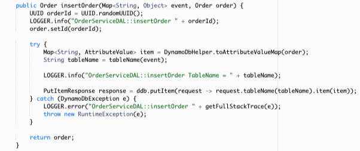</p>

<b>Step 18</b> – Ctrl-S 키보드 단축키를 사용하거나 Cloud9의 <b>File</b> 메뉴에서 <b>Save</b>을 선택하여 변경 사항을 저장해야 합니다. 새로운 코드가 도입 되었으므로 이제 이 업데이트 된 함수를 Lambda 서비스에 배포해야합니다. 이 업데이트를 호출하려면 다음 명령을 실행하십시오.

```
cd /home/ec2-user/environment/saas-factory-serverless-workshop/lab3/order-service/
./update-service.sh
```

<b>Step 19</b> – 변경 사항을 확인하는 마지막 단계는 실제 애플리케이션을 실행하고 새 로깅 호출이 테넌트 테이블 이름을 기록하고 있는지 확인하는 것입니다. 이전과 동일한 CloudFront URL을 사용하여 애플리케이션을 열고 자격 증명으로 로그인 한 다음 페이지 상단의 주문 링크에 액세스합니다. 주문 페이지에서 <b>Add Order</b> 버튼을 선택하고 양식에 새 주문을 입력합니다. 이제 새 주문 양식에서 <b>Add Order</b>를 선택하여 주문을 저장하십시오.

<b>Step 20</b> – 마지막으로 변경의 결과를 확인하려면 함수에 대한 로그 파일을 확인해야 합니다. AWS 콘솔에서 CloudWatch 서비스를 열고 페이지 왼쪽의 탐색 창에서 <b>Log Group</b>을 선택합니다. 그러면 여러 로그 그룹 목록이 표시됩니다. 목록의 범위를 좁히려면 함수 목록 상단의 필터 상자에 <b>/aws/lambda/saas-factory-srvls-wrkshp-orders-insert</b>를 입력합니다. 이제 목록에 표시된 함수 이름을 선택하십시오. 그러면 다음과 유사한 선택한 기능에 대한 로그 스트림 목록이 표시됩니다.

<p align="center">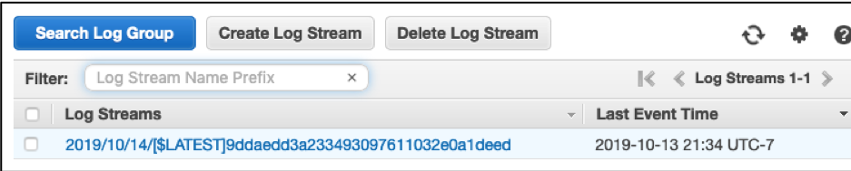</p>

<b>Step 21</b> – 로그 파일 내용에 액세스하려면 상단 로그 스트림을 클릭합니다. 로그에 들어가면 새로 삽입한 로그 파일을 검색해야 합니다. 궁극적으로 수행한 주문 생성과 관련된 DynamoDB 테이블 이름을 찾을 수 있습니다.

<p align="center">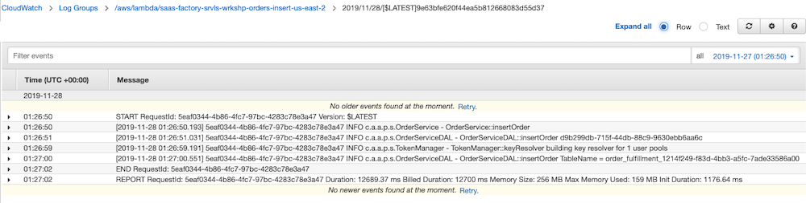</p>

## 시퀀스 다이어그램

<details>
<summary>Basic Flow</summary>
<div markdown="1">
<p align="center">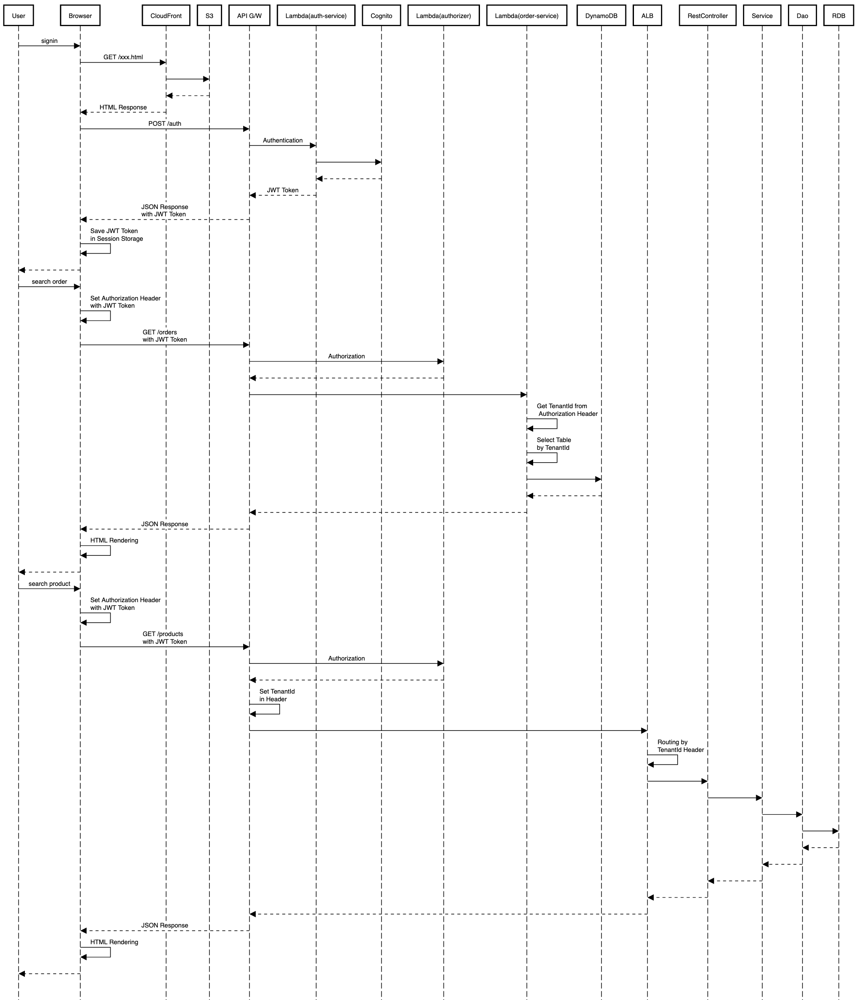</p>
</div>
</details>
<!--
https://sequencediagram.org/index.html#initialData=A4QwTgLglgxloDsIAICqBnApmAUKSs8ISyAQmAPYDuWu+0ciKAwgDYUCuAJgGKVJ5wDIiQDKAZkEFGxFAEEACgElkAcQD0AdSnCmyADIgAtgCMuIABQgOEABYBaWgDdYmAJQ7Ce5hQDmCKAgKTxkSQ1NzKxtbCjAoAC9sD3ovWQNjM0tYrmxHbBcYdxCRFAARAE8EYwpS0mK9OX06lNCUACVMdAgfJEpWVmx6tNF81yGSUpBglpLkNtqcHExe8vRQOARfZAAGADoANkWMXIA+cmpaAC50KH8oBBxzmlO2Tl5+CEu1AFEAFWR1AAPYG7WwQIysHCvbh8ChIewnCSXHASewI6HvOGfKHsGEfNFnSjPMBfAASvwAsvo5p1gHCsI8ibQEYoVBpNJcFAB5UT-dTWOw4VlqLQI8KZKJ2PJgAruL5yaLLBggaBwnDiyIChzOVxudF+AJBZE+O5BAkayxa6WytzIi2S7WjQp6lnKEUcgBSmn+vwoAGtlkK3eyCU8rh7RFyAHI0tb0zAAHQQVECtmQXp9-sDYdOOZJyFEICcmHT3uQvoDCGQSfuBc6NzhBaCYBAvkwjIuuQRx3zR2ZhM7+aw4BgaeygzzCLzlxG8misQSKqgjdJmBAOTA1eTqdLmcrHeJrrZWkuqj+APHYHQSZTdl35azD2FIZO9q1C8SYFtyAVdg-S7VN95ziT8XROZ8T2QINj00MUMkiS9rV1L51XgrIwA3JDnTgiJ0MwnVnS+VRMBQX5llkJQuGQAAzSgjCTH9gMXVUq1XddBntRCCPcHCJS4p05TrAYYFIkATAGLcTHKctyKQSjUNwix+JlXUEQqKojBqUhkXU6panNNClIw3JuNtaD3QAHjRTjjLALC5XMkMpyZbBLgjaNYzpBAGUnAdiTJSlqQ6BAN3uXwD2ZbsrignAe2cwdrjXMBR2QYBKC4DgRIi3MXJJWdGL-ECANYtcNy3W80wzB9918iCOTPPk0ooDKROvbc7yqitAzq3jNSY0D5X64qFIld8QKSAk6pQnrwODSD8rIqo5KomsSvY3AZsabShSaFkmkuNpOGgTZkCkrdFooqi2I3HbSARDouh6CA+gGXsHu6LEXtOEYVMKZEftlNSph0qZ7tqZF5juoGKBBigCQB1x-oEgl3qer6SVuqz7FRz6KH6VzHK0LGtuRHr4v89yYweryfNy8novJKkaRC7Awuyuyotc5AgA
-->

## 리뷰

이 실습은 마이그레이션 프로세스의 주요 단계를 담았습니다. 이제 모놀리식 애플리케이션을 마이크로서비스로 분해하는 점진적인 마이그레이션을 시작했습니다. 이 모델의 핵심 요소는 모놀리식에 남아있는 코드와 함께 이러한 새로운 마이크로서비스를 나란히 실행할 수있는 체계를 만드는 것이었습니다. 이 시나리오에서는 Order 서비스를 분리하여 서버리스 마이크로서비스로 이동했습니다. 또한 관리하는 데이터 역시 새로운 환경으로 옮겼습니다. 그런 다음 API Gateway를 설정하여 트래픽을 선택적으로 마이크로서비스 또는 모놀리스로 전달했습니다 (액세스중인 기능에 따라 다름).

여기까지 여러분은 Lab 3을 마쳤습니다.🤗

[Lab 4 계속하기](../lab4/README.md)
