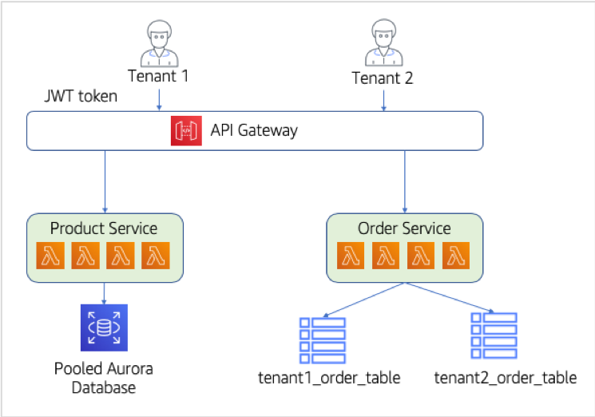
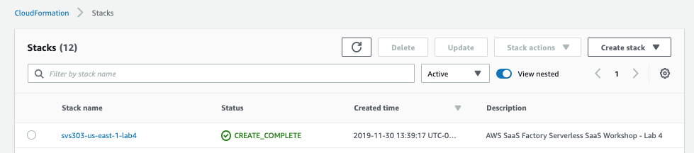
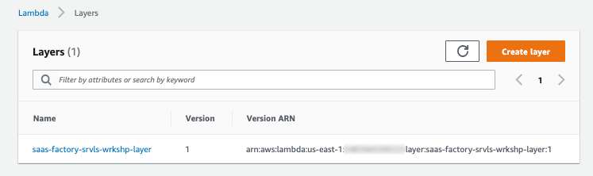
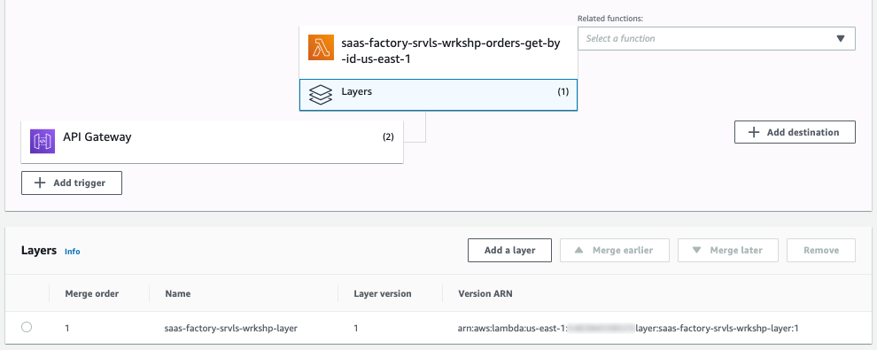
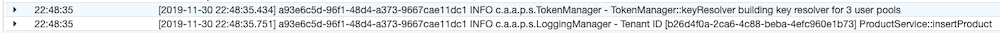
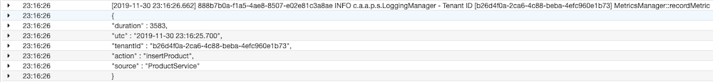
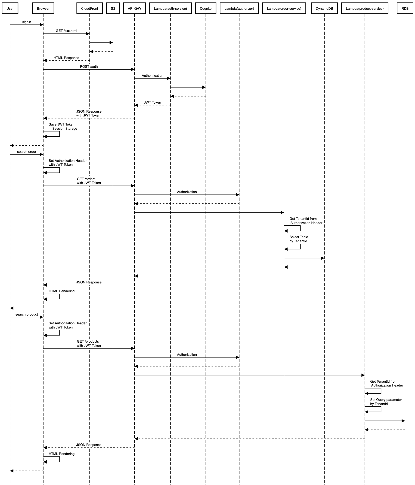

# Lab 4 – Extracting the Remaining Service - Goodbye Monolith!

여기까지 서버리스 SaaS로의 마이그레이션이 잘 진행되고 있습니다.👍🏻 우리는 지금까지 새로운 멀티 테넌트 마이크로서비스와 기존 모놀리식에 대한 병렬 연결을 지원하는 온보딩, Identity 모델을 만들었습니다. 사실 이런 방식은 많은 조직들이 거쳐가는 핵심 단계들입니다. 여러분은 마이크로서비스로 서비스 일부를 옮기면서도 모놀리식과 함께 서비스가 동작되는 모습을 확인했으므로 이제 모놀리식 아키텍처가 더 이상 필요하지 않을 때까지 점점 더 많은 서비스를 분리/구성하는데 남은 세션을 사용할 수 있게 되었습니다!

실제 현장의 시나리오에서 이런 전환은 비즈니스 로직과 데이터를 마이크로서비스 모델로 천천히 마이그레이션해야 함은 물론이고 동시에 상당한 시간과 자원을 투자해야 하는 다소 복잡한 프로세스입니다. 그러나 우리는 모놀리식에서 마이크로서비스 SaaS 모델로의 기능적 전환 과정을 충실히 보여드리기 위해서 샘플 애플리케이션의 기능과 범위를 의도적으로 복잡하지 않게 만들었습니다.😂

이번 실습에서는 모놀리식 애플리케이션에서 기능의 마지막 부분을 추출하려면 Product(제품) 서비스를 마저 독립형 마이크로서비스로 이동해야합니다. 그런데 이미 여러 마이크로서비스가 있고 이 여러 마이크로서비스들이 공통적으로 사용하는 컨셉과 코드가 있다는 점을 잊지 말아야 합니다.(즉 이 부분도 효율적으로 변경이 필요하다는 의미 입니다😎) 또한 이 서비스에 대한 또 다른 데이터 파티셔닝 모델들도 고려해야 합니다. 이번 실습에서 선택한 데이터 파티셔닝 모델은 공유 구조 안에 모든 테넌트의 데이터를 저장하는 관계형 데이터베이스를 바탕으로 하고 있습니다.(이를 <b>pool</b> model 이라고 함).

이 실습 단계의 아키텍처는 훨씬 간단합니다. 이제 테넌트가 온보딩 할 때마다 전체 모놀리식 스택을 프로비저닝 할 필요가 없습니다. 대신, 이제 테넌트는 모두 자체적으로 확장할 수 있고 각 테넌트에 대해 별도의 프로비저닝이 필요하지 않은 서버리스 마이크로서비스를 공유합니다. 아래 다이어그램은 새 아키텍처에 대한 개념적인 모습을 보여주고 있습니다:

<p align="center"></p>

이 다이어그램은 마이그레이션 프로세스의 완성된 모습을 나타내며, 시스템의 기능이 이제 API Gateway와 두 개의 논리적 마이크로서비스 (여러 Lambda 함수의 복합)에서 지원되고 있음을 강조하고 있습니다.

## What You'll Be Building

이번 실습은 가상의 전자상거래 서비스를 최종적으로 모놀리식으로부터 완전히 떠나는 것을 목표로 합니다. 이 최종 마이그레이션을 수행하는 기본 항목들은 다음과 같습니다.

- 모놀리식 애플리케이션에서 마지막 서비스 모듈인 제품 서비스를 추출합니다. 이 서비스는 대부분 Lab 3의 주문 서비스와 동일한 방식으로 이동합니다. 제품 서비스의 서버리스 버전을 위한 새로운 Lambda 함수 배포부터 시작할 것 입니다.

- 이제 마이크로서비스 스택에 두 번째 서비스를 갖게 되었으므로 각 서비스들이 공통적으로 사용하는 로직을 추출하고 이를 서비스 전반에 걸쳐 공유할 효율적인 방법을 고민해 보아야 합니다. 서버리스 세계에서는 Lambda layer을 사용하여 이를 구현 할 수 있습니다. layer는 Lambda 함수가 함수 자체와 별도로 배포하고 버전을 지정할 수있는 공유 코드에 액세스 할 수있는 메커니즘을 제공합니다(\*Library 개념). 이 기능을 활용해 기존 토큰 관리 코드를 주문 서비스에서 layer으로 이동하여 주문 서비스와 제품 서비스 모두 함께 사용할 수 있도록 하고 새로운 멀티 테넌트 인식 로깅 및 메트릭 라이브러리를 만들어 layer에 추가 할 것입니다.

- 제품 및 주문 서비스에 이러한 layer의 코드를 사용하여 테넌트별로 식별된 로깅/메트릭을 구현할 수 있는 장치 하나를 추가하려고 합니다.

- 서비스 마이그레이션의 일환으로 제품 데이터를 표현하는 방법도 살펴 봅니다. 이 경우 관계형 데이터베이스의 테이블이 공유 구조의 모든 테넌트에 대한 데이터를 보유하는 <b>pool</b> model을 사용합니다. 테이블의 컬럼 하나는 테넌트 식별자에 의해 데이터를 구별하는 데 사용됩니다.

이 단계들이 완료되면 마이그레이션의 핵심 요소가 완료됩니다. 우리는 또한 앞으로 때 새로운 서비스가 추가되는 과정을 단순화할 계층을 마련 할 것입니다.

## Step-By-Step Guide

다음은 새로운 공유 계층을 구축하고 제품 서비스를 모놀리식에서 서버리스 마이크로서비스로 이동하기 위한 단계별 프로세스를 안내 합니다!

<b>Step 1</b> - 새로운 제품(Product) 마이크로서비스를 배포하겠습니다. 이전과 마찬가지로 Lambda 함수에 필요한 모든 부분을 빌드 및 업로드 한 다음 CloudFormation 스택을 통해 필요한 요소들을 프로비저닝하는 스크립트를 실행합니다. 이 스크립트를 시작하려면 Cloud9 IDE의 터미널 창에서 다음 명령을 실행하십시오.

```
cd /home/ec2-user/environment/saas-factory-serverless-workshop/resources
./lab4.sh
```

이 명령은 CloudFormation 스택 생성을 시작할 것입니다. <b>다음 단계를 진행 하기 전에, 아래와 같이 lab4의 스택이 성공적으로 생성되었는지 먼저 확인해야 합니다!</b>:

<p align="center"></p>

<b>Step 2</b> - <b>계속하기 전에 lab4 CloudFormation 스택이 성공적으로 완료되었는지 확인해야 합니다</b>. 이제 웹 클라이언트가 위에서 CloudFormation 스택의 일부로 생성된 새로운 엔드 포인트를 사용하도록 React 클라이언트를 업데이트합니다. 다음 명령을 실행하여 웹 클라이언트를 업데이트하십시오.

```
cd /home/ec2-user/environment/saas-factory-serverless-workshop/resources
./website-lab4.sh
```

<b>Step 3</b> – 이제 아키텍처로 이동할 두 번째 마이크로서비스가 준비되었므로 테넌트 컨텍스트를 가진 공통 메커니즘을 재사용 가능한 메커니즘으로 이동하는 방법에 대해 생각해야합니다. 이를 위해 우리는 확실히 라이브러리와 프레임워크를 사용할 수 있습니다. 이 때 문제는 어떻게 우리 서비스 전반에 걸쳐 재사용 할 수 있는가? 입니다. 이 부분에서 Lambda layer가 역할을 담당 합니다. layer을 사용하면 멀티 테넌시의 세부 사항을 숨길 수 있도록 지원하는 공유 코드를 별도로 배포하고 버전을 지정할 수 있습니다. lab 3의 주문 서비스에서 이미 사용하고있는 일부 코드로 시작해 보겠습니다. 이제 토큰 관리자 클래스를 주문 서비스에서 공유 layer로 이동할 수 있습니다.

토큰 관리자의 역할은 제공된 JWT 토큰에서 테넌트 식별자 획득 과정을 단순화하는 것입니다. layer을 통해 여러분은 Lambda 함수들을 분리함으로써 소프트웨어 엔지니어링 모범 사례를 따를 수 있습니다. 이 클래스는 코드 중복을 최소화하면서 기능을 확장하기 위해 layer의 다른 클래스에서 가져옵니다. Cloud9 환경에서 <b>lab4/layers/serverless-saas-layer/src/main/java /</b>로 이동하고 Java 패키지 이름을 정의하는 일련의 폴더 내에서 <b>TokenManager.java</b> 두 번 클릭합니다. 이 클래스에 대한 코드의 일부가 아래와 같습니다.

```java
private static final String TENANT_CLAIM = "custom:tenant_id";

public String getTenantId(Map<String, Object> event) {
    String bearerToken = ((Map<String, String>) event.get("headers")).get("Authorization");
    String jwtToken = bearerToken.substring(bearerToken.indexOf(" ") + 1);
    Claims verifiedClaims = Jwts.parser()
            .setSigningKeyResolver(keyResolver())
            .parseClaimsJws(jwtToken)
            .getBody();

    String tenantId = verifiedClaims.get(TENANT_CLAIM, String.class);

    if (tenantId == null) {
        throw new RuntimeException("No tenant id in token");
    }

    return tenantId;
}
```

토큰 관리자는 요청 이벤트의 Authorization 헤더에서 Bearer 토큰을 추출합니다. 그런 다음 서명된 토큰을 해독하고 JWT에 포함된 모든 클레임 (이름/값 쌍)의 압축을 풉니다. 토큰의 압축이 풀리면 ID 공급자 (이 경우 Cognito)가 정의한 사용자 지정 클레임을 사용하여 클레임에서 테넌트 ID를 가져오고 이 값을 반환합니다.

<b>Step 4</b> - 토큰 관리자가 준비되면 토큰 관리자를 참조할 다른 layer 코드를 도입 할 수 있습니다. 이들 중 첫 번째는 로깅 관리자입니다. 로깅 코드를 layer 로 이동하면 로깅 호출을 수행하고 로깅 관리자가 테넌트 컨텍스트를 주입하도록 할 수 있습니다. 복잡하지는 않지만 개발자로 부터 테넌트 세부 정보를 숨기는데 좋은 방법입니다. Cloud9에서 <b>LoggingManager.java</b> 파일을 두 번 클릭하여 엽니다. 이 클래스에 대한 코드의 일부가 아래에 나와 있습니다.

```java
public static void info(Map<String, Object> event, String message) {
    LOGGER.info(decorateMessage(event, message));
}

private static String decorateMessage(Map<String, Object> event, String message) {
    return "Tenant ID [" + new TokenManager().getTenantId(event) + "] " + message;
}
```

LoggingManager는 TokenManager에 의존하여 수신 요청(incoming request)에서 테넌트 ID를 추출합니다. 새로운 LoggingManager는 모든 로그 메시지에 항상 멀티 테넌트 시스템의 모니터링 및 디버깅에 도움이되는 테넌트 컨텍스트가 포함되도록 합니다.

<b>Step 5</b> – 레이어에 추가할 마지막 항목은 메트릭 관리자입니다. 이 도우미는 테넌트 컨텍스트로 메트릭 데이터를 게시하는 데 사용됩니다. 지표 기록 및 게시는 SaaS 조직에 필수적입니다. 여기에 있는 것은 다소 간단하고 가볍지만 SaaS 솔루션에 테넌트 인식 메트릭을 추가하는 것의 중요성을 보여주고 싶었습니다. <b> MetricsManager.java </b> 파일을 열어 이 워크숍을 위해 만든 간단한 측정 항목 관리자를 확인하세요. 이 클래스에 대한 코드의 일부가 아래에 나와 있습니다.

```java
public static void recordMetric(Map<String, Object> event, String source, String action, Long duration) {
    String tenantId = new TokenManager().getTenantId(event);

    Map<String, Object> metric = new HashMap<>();
    metric.put("tenantId", tenantId);
    metric.put("source", source);
    metric.put("action", action);
    metric.put("duration", duration);
    metric.put("utc", Instant.now().truncatedTo(ChronoUnit.MILLIS).toString().substring(0, 23).replace('T', ' '));

    String json;
    try {
        json = MAPPER.writerWithDefaultPrettyPrinter().writeValueAsString(metric);
    } catch (JsonProcessingException e) {
        LoggingManager.error(event, getFullStackTrace(e));
        json = e.getMessage();
    }

    LoggingManager.log(event, "MetricsManager::recordMetric\n" + json);
}
```

이 코드는 또한 TokenManager를 사용하여 각 메트릭을 위한 데이터를 만듭니다. 여기서 사용하는 우리의 메트릭은 단순히 주어진 소스와 액션에 대한 실행 시간입니다. 이 지표 데이터를 이 워크숍을 위해 단순하게 로그 파일로 보내겠지만, 리얼 월드에서는 Amazon SQS 또는 Amazon Kinesis Data Firehose와 같은 도구를 사용하여 이 메트릭을 데이터 수집 파이프라인과 통합하는 방법을 생각해 볼 수도 있습니다.

<b>Step 6</b> – 여러분은 아마 우리가 왜 세 개의 helper를 모두 단일 layer에 배치하는지 그 이유가 궁금 할 수 있습니다. 왜 그들 자신의 layer로 분리하지 않을까요? 기능을 별도로 유지하고 싶지만 Lambda 함수 당 보유할 수있는 layer 수에는 상대적으로 낮은 제한(limit)이 있습니다. 제한을 유지하기 위해 필요에 따라 layer 코드를 패키징하는 것이 가장 좋습니다.

이 실습을 시작할 때 실행한 배포 스크립트는 layer를 배포하고 이를 제품 서비스 Lambda 함수에 연결합니다. 참고로 주문 서비스 기능은 이전 lab의 단계로 이미 배포되었습니다. 이제 layer를 활용하기 위해 주문 서비스를 업데이트해야 합니다. 이를 위하여 Cloud9 IDE의 터미널 창에 다음 명령을 입력하여 새 layer를 사용하도록 주문 서비스 기능을 구성합니다:

```
cd /home/ec2-user/environment/saas-factory-serverless-workshop/lab4/order-service
./update-layers.sh
```

<b>Step 7</b> – layer가 성공적으로 배포되었는지 확인하기 위해 AWS 콘솔에서 Lambda 서비스를 열어 보겠습니다. Lambda 페이지가 열리면 페이지 왼쪽에서 <b>Layers</b> 옵션을 선택합니다. 그러면 멀티 테넌트 토큰, 로깅 및 메트릭 코드를 포함해야 하는 레이어 목록이 표시됩니다. 보기는 다음과 같이 나타납니다.

<p align="center"></p>

<b>Step 8</b> - layer가 함수들과 통합 되었는지 확인해야합니다. Lambda 서비스 콘솔의 왼쪽 메뉴에서 <b>Functions</b> 링크를 클릭합니다. 이 목록의 범위를 좁히려면 함수 목록 위의 필터 상자에 <b>saas-factory-srvls-wrkshp-orders</b>를 입력합니다. 주문 서비스 기능을 선택하여 기능에 대한 세부 사항 페이지를 여십시오. <b>Designer</b> 섹션에서 함수 이름 아래의 <b>Layers</b> 아이콘을 클릭하면 layer가 함수와 병합 되었음을 알 수 있습니다.

<p align="center"></p>

<b>Step 9</b> – 이제 우리의 제품 서비스의 새로운 서버리스 버전을 살펴볼 때입니다. 제품 서비스 마이그레이션은 모놀리스 해체의 마지막 부분이었습니다. 이를 위해서는 서비스의 멀티 테넌트 버전과 데이터베이스를 모두 만들어야 했습니다. 서비스 코드부터 시작하겠습니다. Cloud9에서 <b>lab4/product-service/src/main/java</b>를 열고 Java 패키지 이름을 정의하는 일련의 폴더 내에서 두 번 클릭하여 <b>ProductService.java</b>를 엽니다. 이 클래스는 주문 서비스와 마찬가지로 Lab 2의 모놀리식 REST API 컨트롤러 클래스와 유사한 전환을 거쳤음을 알 수 있습니다. 이 클래스에는 제품 서비스에 대한 GET, PUT, POST 및 DELETE 메서드를 구현하는 다양한 메서드가 포함되어 있습니다. 각 메서드는 논리적 제품 서비스를 구성하기 위해 별도의 Lambda 함수로 배포됩니다. 다음은 코드 일부 입니다.

```java
public APIGatewayProxyResponseEvent getProducts(Map<String, Object> event, Context context) {
    LoggingManager.log(event, "ProductService::getProducts");
    List<Product> products = DAL.getProducts(event);
    APIGatewayProxyResponseEvent response = new APIGatewayProxyResponseEvent()
            .withStatusCode(200)
            .withHeaders(CORS)
            .withBody(toJson(products));
    return response;
}
```

이 서비스의 코드와 주문 서비스는 모두 새로운 공유 Lambda layer를 활용하도록 업데이트 되었습니다. 눈에 보이는 주요 차이점은 로깅 호출의 변경입니다. 이전 버전이 메시지와 함께 static class logger 라고 했던 곳에서, 새로운 제품 및 주문 서비스는 이제 layer에서 JWT 토큰이 포함된 수신 요청(incoming request)로 부터 <b>이벤트</b>를 전달하며<b>LoggingManager</b>를 호출하도록 변경되었습니다!

<b>Step 10</b> – 또한 단일 테넌트 모놀리식에서 마이크로서비스 모델로 제품 서비스 용 데이터베이스를 마이그레이션 했습니다. 주문 서비스와 마찬가지로 제품 서비스가 멀티 테넌트 모델에서 데이터를 표현하는 방법을 고민해야만 합니다. 이것은 성능, 테넌트 격리 등에 대해 생각하는 것을 의미합니다. 우리는 제품의 경우 테넌트 데이터가 관계형 데이터베이스의 동일한 테이블 (컬럼으로 분리됨)에 테넌트 데이터가 공존하는 <b>pooled</b> 모델을 사용하여 데이터 파티셔닝의 또 다른 특징을 보여 주고자 했습니다(테넌트 구분자가 포함된 컬럼으로 격리하는). 즉, 이제 우리 서비스는 모든 테넌트에 대해 동일한 데이터베이스를 사용하고 새 테넌트가 도입 될 때 새 테이블이나 기타 구성을 프로비저닝 할 필요가 없습니다.

여러 측면에서 멀티 테넌트 데이터베이스와 상호 작용하는 코드는 이전에 사용하던 사일로 버전에서 크게 변경되지 않았습니다 (둘 다 관계형 데이터베이스에 대해 작업하고 스키마가 대부분 변경되지 않았기 때문에). 모놀리식 데이터베이스에서 풀링된 멀티 테넌트 표현으로 이동하는 데 필요한 사소한 조정을 보여주는 몇 가지 SQL 코드를 살펴 보겠습니다. 파일 이름을 두 번 클릭하여 Cloud9에서 <b>ProductServiceDAL.java</b>를 엽니 다. 다음은 해당 파일의 일부 코드 입니다.

```java
private final static String INSERT_PRODUCT_SQL = "INSERT INTO product (tenant_id, sku, product, price) VALUES (?, ?, ?, ?)";
private final static String SELECT_CATEGORY_SQL = "SELECT category_id, category FROM category WHERE tenant_id = ?";
```

이 쿼리문은 여러 테넌트간에 데이터를 분할하기 위해 공유 데이터베이스를 쿼리할 때 <b>tenant_id</b> 컬럼에 대한 참조를 추가하는 방법을 보여줍니다.

<b>Step 11</b> – 서비스가 실제로 멀티 테넌트 방식으로 실행되고 있는지 확인하기 위해 데이터 파티셔닝 및 로깅 메시지가 예상한 위치에 있는지 확인하겠습니다. 위에서 캡처 한 것과 동일한 CloudFront URL을 사용하여 애플리케이션을 다시 엽니다. <b><i>브라우저를 새로 고침</i></b>하여 React 앱의 새 사본을 강제로 가져오도록 합니다.

애플리케이션에 로그인하고 페이지 상단의 탐색에서 <b>Products</b> 링크를 선택합니다. 이제 <b>Add Product</b> 버튼을 선택하고 제품 추가 양식에 새 제품 정보를 입력하십시오. 완료되면 양식 하단의 <b>Add Product</b> 버튼을 선택하여 새 제품 정보를 저장하십시오.

<b>Step 12</b> – AWS 콘솔에서 CloudWatch 서비스를 열고 왼쪽 메뉴에서 <b>Log Groups</b>을 선택합니다. 화면 상단의 <b>Filter</b> 상자에 <b>/aws/lambda/saas-factory-srvls-wrkshp-products-insert</b>를 입력하고 최신 로그 스트림을 선택합니다. 자세히 살펴보면 Tenant ID가 접두사로 붙은 LoggingManager의 로그 항목을 볼 수 있습니다. 테넌트 인식 로거를 사용하지 않은 로그 항목도 표시되며 Tenant ID 접두사가 없습니다.

<p align="center"></p>

<b>Step 13</b> - 이제 워크숍의 마지막 활동으로 테넌트별 구별 기능이 포함된 MetricsManager를 연결하겠습니다. Cloud9로 돌아가 <b>ProductService.java</b>를 열고 <b>insertProduct</b> 메소드로 이동합니다. 아래 코드와 같이 MetricManager 를 활용하여 수행 시간을 기록하는 코드를 추가 합니다. 추가 후 최종 insertProduct 메소드는 다음과 같아야 합니다.

```java
public APIGatewayProxyResponseEvent insertProduct(Map<String, Object> event, Context context) {
    long startTimeMillis = System.currentTimeMillis();

    LoggingManager.log(event, "ProductService::insertProduct");
    APIGatewayProxyResponseEvent response = null;
    Product product = productFromJson((String) event.get("body"));
    if (product == null) {
        response = new APIGatewayProxyResponseEvent()
                .withStatusCode(400);
    } else {
        product = DAL.insertProduct(event, product);
        response = new APIGatewayProxyResponseEvent()
                .withStatusCode(200)
                .withHeaders(CORS)
                .withBody(toJson(product));
    }

    long totalTimeMillis = System.currentTimeMillis() - startTimeMillis;
    MetricsManager.recordMetric(event, "ProductService", "insertProduct", totalTimeMillis);

    return response;
}
```

Ctrl-S 키보드 단축키를 사용하거나 Cloud9의 <b>File</b> 메뉴에서 <b>Save</b>을 선택하여 변경 사항을 저장해야 합니다.

<b>Step 14</b> - 이제 제품 서비스를 다시 배포해야 합니다. 다음 명령을 입력하여 Lambda 함수를 다시 빌드하고 배포합니다.

```
cd /home/ec2-user/environment/saas-factory-serverless-workshop/lab4/product-service
./update-service.sh
```

<b>Step 15</b> - 이전과 동일한 URL을 사용하여 애플리케이션으로 돌아가서 새 제품을 추가합니다.

<b>Step 16</b> - 새 제품을 추가하면 MetricsManager layer 기능이 실행되었을 것입니다. AWS 콘솔의 CloudWatch로 이동하여 찾을 수 있는지 확인하겠습니다. 다시 왼쪽 메뉴에서 <b>Log Groups</b>을 선택하고 <b>Filter</b>에서 <b>/aws/lambda/saas-factory-srvls-wrkshp-products-insert</b>를 입력합니다. 그리고 가장 최근의 로그 스트림을 선택합니다. 다음과 유사한 지표 데이터 패킷 (JSON 형식)이있는 로그 항목이 확인되어야 합니다.

<p align="center"></p>

## Sequence Diagram

<details>
<summary>Basic Flow</summary>
<div markdown="1">
<p align="center"></p>
</div>
</details>
<!--
https://sequencediagram.org/index.html#initialData=A4QwTgLglgxloDsIAICqBnApmAUKSs8ISyAQmAPYDuWu+0ciKAwgDYUCuAJgGKVJ5wDIiQDKAZkEFGxFAEEACgElkAcQD0AdSnCmyADIgAtgCMuIABQgOEABYBaWgDdYmAJQ7Ce5hQDmCKAgKTxkSQ1NzKxtbCjAoAC9sD3ovWQNjM0tYrmxHbBcYdxCRFAARAE8EYwpS0mK9cMyLYEouDhgIPLACopTQlAAlWpwcTCQwcvRQOARfZAAGADoANhGcDFyAPnJqWgAudCh-KAQcHZottk5efgg9tQBRABVkdQAPD8XbCCNWHCvuHwKEh7JsJHscBJ7KCATdgXd-uxAbdodtKBcwPcABJPACy+mQA0wU2BWDO6NooMUKg0mj2CgA8qIXuprHYcNS1FpQY1ImyHM5XG57nJomMGCBoMCcLzLPyuj03DC-AEghCfMcgqjZVE7AqhRCdfLBYUlVTlFy6QApTQvJ4UADWYw5FtpqPO+ytogZADlCcTgKTMAAdBBUQK2ZA2u2O50erbxzHIUQgJyYKO25D2p0IZChk7J4mHYHJoJgEC+TDk3a5UEbJMjeugxP3LDgGCR7LYasY5sU7B7USYeTRWIJSVQEtYzAgHJgPNhiMZmM5nuUzac2l7VTPV5dsDoUPhuzLrOx06b7mbI2juKJMDC5Ciuxj+IT6U3l93pKoy905AujSV46vu+qmvcMoZJEoEmu4PJQVkYBzmB7j3Kow5ZmMshKFwyAAGaUEYoZPre45Srm06zt2IFIbksFKteCEWDB+QGoWrCYB0WYgCYHELiY5SYVUSA4ZBESIch9GghUVRGDUpAQjJ1S1NqTEsd0BqAZaAA80I0ZJrHgVpbp9jWmJer6-okggZKJqZGLYniBJEggc4nL4a61ps9YQes64tsgbZgB2yAtBQbQdJ5YD2fsQ4jl+ZGThRM5zgux6RtGZ6rnZG6ulo267uoYURRA6BpUumXZs6f7weJuoxN+D4iqRb7kWJTT8q+P7mkB-7GcBTHFe0nT0RBOpDR0KEMeNrTDVNaEYU8WEibhBEUERubPg1iVTil1GDbNk1SYxdUTSNhmoXFyAAIocNggn4MYw7YKGAlCdhXDtZEZ1TaCQwKTg-2qadh3nRpRl-rp9gzeFc2jf1mjuv25nen6RLWbZyMxQOyA4vi-qudg7lRaiPkAUAA
-->

## Review

이번 실습은 모놀리식으로 부터 마이크로서비스 기반의 SaaS로의 전환 과정에 있어 마지막 단계였습니다. 이 단계에서 여러분은 마지막으로 모놀리식에 남아 있던 제품 서비스 모듈을 서버리스 마이크로서비스로 옮겼습니다. 이로써 이제 모놀리식과 서버리스 마이크로서비스를 병행해 운영할 필요 없이 단 하나의 마이크로서비스 기반의 멀티 테넌트 모델을 갖추게 되었습니다. 그리고 전환 과정의 일환으로 멀티 테넌트 마이크로서비스들이 효과적으로 코드를 공유할 수 있도록 layer라는 lambda기능을 사용했습니다. 이를 활용해 로깅, 메트릭 그리고 토큰 관리 모듈을 공통 라이브러리처럼 만들어 효율적으로 사용했습니다.

긴 시간동안 워크샵 완료 하느라 고생하셨습니다!🙏
